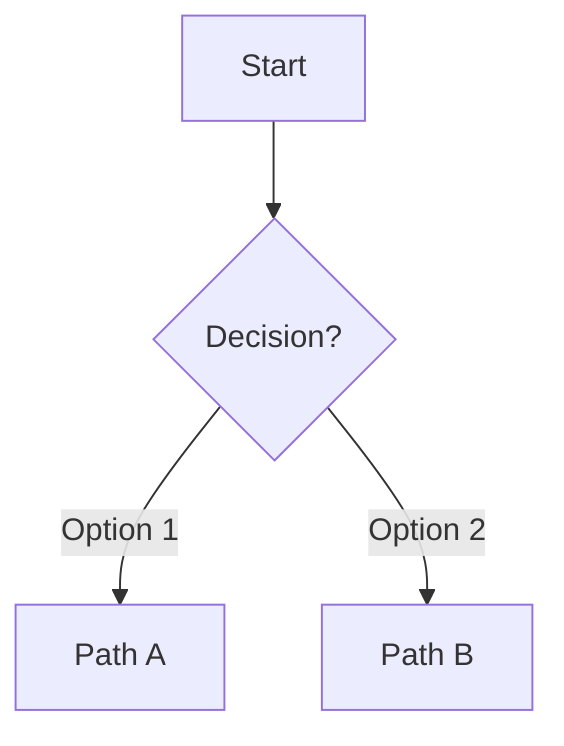

# Agent Specification Standards

> **Important**: This accelerator uses two distinct agent systems:
> 
> | Directory | Purpose | Format |
> |-----------|---------|--------|
> | `.github/agents/` | VS Code Chat Agents | `*.agent.md` with tools/model frontmatter |
> | `agents/` (root) | Accelerator workflow specifications | Detailed markdown with MCP/dependencies |
> 
> See [awesome-copilot agents.instructions.md](https://github.com/github/awesome-copilot/blob/main/instructions/agents.instructions.md) for Chat Agent best practices.

## Agent File Structure

```
agents/
├── README.md                       # Overview and index
├── INDEX.md                        # Complete agent registry
├── DEPLOYMENT_SEQUENCE.md          # Deployment order
├── DEPENDENCY_GRAPH.md             # Agent dependencies
├── MCP_SERVERS_GUIDE.md            # MCP configuration
├── TERRAFORM_MODULES_REFERENCE.md  # Module mapping
├── h1-foundation/
│   ├── infrastructure-agent.md
│   ├── networking-agent.md
│   ├── security-agent.md
│   └── database-agent.md
├── h2-enhancement/
│   ├── gitops-agent.md
│   ├── observability-agent.md
│   └── rhdh-portal-agent.md
├── h3-innovation/
│   ├── ai-foundry-agent.md
│   └── mlops-pipeline-agent.md
└── cross-cutting/
    ├── validation-agent.md
    ├── rollback-agent.md
    └── cost-optimization-agent.md
```

## Agent Specification Template

```markdown
---
name: agent-name
horizon: h1|h2|h3|cross-cutting
type: deployment|validation|maintenance|migration
dependencies:
  - dependency-agent-1
  - dependency-agent-2
mcp_servers:
  - server-name-1
  - server-name-2
---

# Agent Name

Brief description of the agent's purpose and responsibilities.

## Overview

- **Horizon**: H1 Foundation / H2 Enhancement / H3 Innovation
- **Type**: Deployment / Validation / Maintenance
- **Complexity**: Low / Medium / High
- **Estimated Time**: X minutes

## Prerequisites

### Required Agents
- [dependency-agent](./dependency-agent.md) - Why needed

### Required Credentials
- Azure subscription with Contributor role
- GitHub personal access token

### Required CLIs
- terraform >= 1.5
- az >= 2.50
- kubectl >= 1.28

## MCP Servers

| Server | Purpose | Usage |
|--------|---------|-------|
| mcp_azure_* | Azure operations | Resource management |
| mcp_github_* | GitHub operations | Repository management |

## Inputs

| Name | Type | Required | Description |
|------|------|----------|-------------|
| environment | string | yes | Target environment (dev/staging/prod) |
| location | string | yes | Azure region |

## Outputs

| Name | Type | Description |
|------|------|-------------|
| resource_id | string | Created resource ID |
| status | string | Deployment status |

## Workflow Steps

### Step 1: Validation
1. Check prerequisites
2. Validate inputs
3. Verify dependencies

### Step 2: Execution
1. Create resources
2. Configure settings
3. Apply policies

### Step 3: Verification
1. Run health checks
2. Validate outputs
3. Update documentation

## Rollback Procedure

1. Identify failed step
2. Execute compensating actions
3. Restore previous state

## Related Agents

- [related-agent](./related-agent.md) - Relationship description
```

## Naming Conventions

### Agent Names
- Use lowercase with hyphens: `infrastructure-agent`
- Include horizon prefix in organization: `h1-foundation/`
- Use descriptive names: `ai-foundry-agent` not `ai-agent`

### File Names
- Match agent name: `infrastructure-agent.md`
- Use kebab-case: `cost-optimization-agent.md`

## Required Sections

Every agent specification MUST include:

1. **YAML Frontmatter** - Metadata for processing
2. **Overview** - Purpose and scope
3. **Prerequisites** - Required dependencies
4. **MCP Servers** - Available tools
5. **Inputs/Outputs** - Interface definition
6. **Workflow Steps** - Execution procedure
7. **Rollback Procedure** - Recovery steps

## Horizon Organization

### H1 Foundation
- Core infrastructure agents
- Security and networking
- Database and storage

### H2 Enhancement
- Platform services
- GitOps and observability
- Developer portal

### H3 Innovation
- AI/ML capabilities
- Advanced analytics
- Experimental features

### Cross-cutting
- Validation and testing
- Migration and rollback
- Cost optimization

## MCP Server References

Reference MCP servers using consistent format:

```markdown
## MCP Servers

### Azure Operations
- `mcp_azure_*` - Azure resource management
- `mcp_com_microsoft_*` - Azure Terraform best practices

### GitHub Operations
- `mcp_github_*` - Repository and workflow management

### Terminal Operations
- Use `run_in_terminal` for CLI commands (az, terraform, kubectl)
```

## Dependency Declaration

Clearly document dependencies:

```yaml
dependencies:
  - infrastructure-agent      # Creates resource groups
  - networking-agent          # Creates VNets
  - security-agent            # Creates Key Vault
```

## Decision Flow Pattern

For agents with multiple execution paths (e.g., AKS vs ARO), include an `onStart` section:

```yaml
onStart:
  - prompt: "Decision Name"
    question: "Question to ask user"
    options:
      - "option1"
      - "option2"
    required: true
    affects:
      - affected_workflow_section
```

### Decision Matrix

Always include a decision matrix table showing how choices affect the workflow:

| Decision | Path A | Path B |
|----------|--------|--------|
| Step X | How it's done | How it's done differently |

### Execution Flow Diagram

Use mermaid diagrams to visualize the decision tree:



---

## Best Practices

1. **Single Responsibility** - One agent, one purpose
2. **Clear Dependencies** - Explicit dependency declaration
3. **Idempotent Operations** - Safe to re-run
4. **Comprehensive Logging** - Track all actions
5. **Graceful Rollback** - Always recoverable
6. **Decision First** - Collect required decisions before execution

