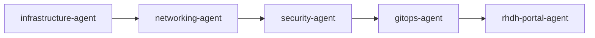
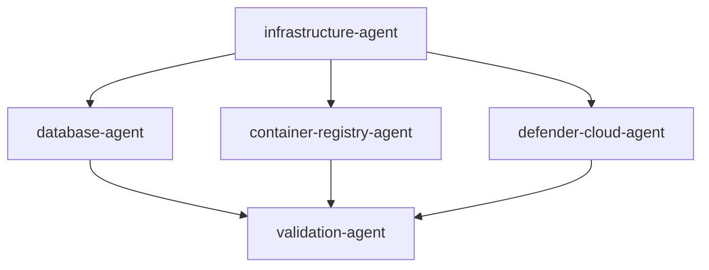
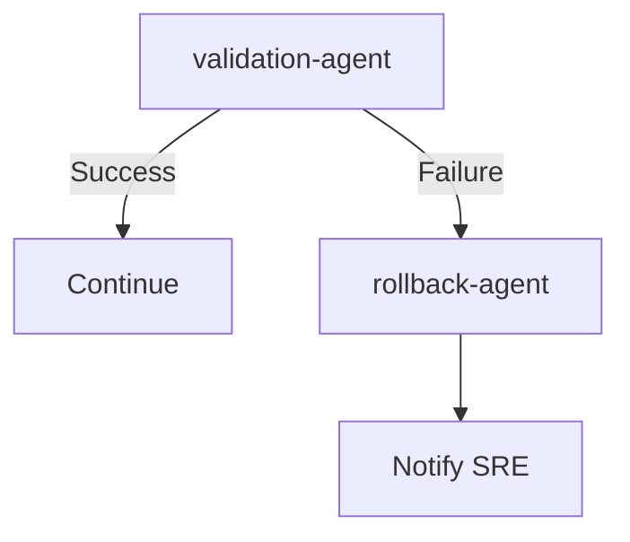
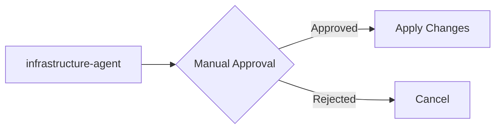
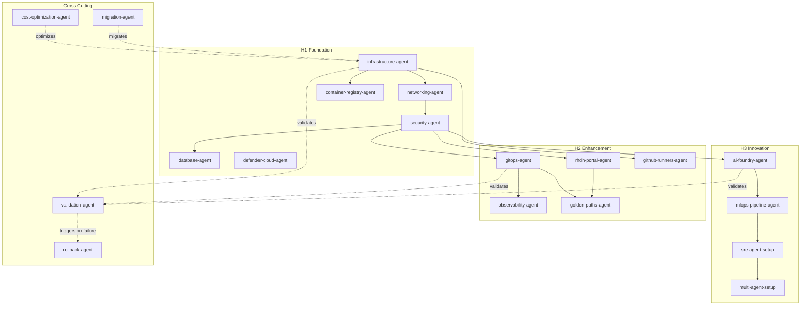

# Agent Integration Guide

> **How agents communicate, orchestrate workflows, and leverage Microsoft Agent Framework**

## Overview

This guide explains how the 23 workflow agents in the Three Horizons Accelerator integrate with each other, leverage shared skills, and can be orchestrated using Microsoft Agent Framework patterns.

---

## Agent Communication Models

### 1. Sequential Dependencies

Agents execute in order, with each requiring prerequisites from previous agents.



**Example: H1 Foundation Deployment**

```yaml
# workflow.yml
name: Deploy H1 Foundation
on:
  workflow_dispatch:

jobs:
  infrastructure:
    uses: ./.github/workflows/infrastructure.yml
    
  networking:
    needs: infrastructure
    uses: ./.github/workflows/networking.yml
    
  security:
    needs: networking
    uses: ./.github/workflows/security.yml
```

### 2. Fan-Out / Fan-In Pattern

Multiple agents execute in parallel, then converge for final validation.



**Example: Parallel H1 Services**

```yaml
jobs:
  infrastructure:
    runs-on: ubuntu-latest
    steps:
      - name: Deploy AKS
        run: terraform apply -target=module.aks
  
  parallel_services:
    needs: infrastructure
    strategy:
      matrix:
        agent: [database, container-registry, defender-cloud]
    runs-on: ubuntu-latest
    steps:
      - name: Deploy ${{ matrix.agent }}
        run: ./agents/${{ matrix.agent }}/deploy.sh
  
  validate:
    needs: parallel_services
    runs-on: ubuntu-latest
    steps:
      - name: Run validation
        run: ./agents/validation-agent/validate.sh --all
```

### 3. Conditional Routing

Agents execute based on conditions (environment, configuration, failures).



**Example: Conditional Rollback**

```yaml
jobs:
  deploy:
    runs-on: ubuntu-latest
    steps:
      - name: Deploy changes
        id: deploy
        run: terraform apply
        continue-on-error: true
      
      - name: Validate deployment
        if: steps.deploy.outcome == 'success'
        id: validate
        run: ./agents/validation-agent/validate.sh
      
      - name: Rollback on failure
        if: steps.validate.outcome == 'failure' || steps.deploy.outcome == 'failure'
        run: ./agents/rollback-agent/rollback.sh
```

### 4. Human-in-the-Loop

Agents pause for manual approval before critical operations.



**Example: Production Approval**

```yaml
jobs:
  plan:
    runs-on: ubuntu-latest
    steps:
      - name: Terraform Plan
        run: terraform plan -out=tfplan
      
      - name: Upload plan
        uses: actions/upload-artifact@v3
        with:
          name: tfplan
          path: tfplan
  
  approval:
    needs: plan
    runs-on: ubuntu-latest
    environment: production  # Requires manual approval
    steps:
      - name: Approval checkpoint
        run: echo "Approved by ${{ github.actor }}"
  
  apply:
    needs: approval
    runs-on: ubuntu-latest
    steps:
      - name: Terraform Apply
        run: terraform apply tfplan
```

---

## Microsoft Agent Framework Integration

For advanced multi-agent orchestration, use **Microsoft Agent Framework**.

### Installation

```bash
# Python
pip install agent-framework-azure-ai==1.0.0b260107
pip install agent-framework-core==1.0.0b260107

# .NET
dotnet add package Microsoft.Agents.AI.AzureAI --prerelease
dotnet add package Microsoft.Agents.AI.Workflows --prerelease
```

### Agent-as-Code Pattern

**Convert workflow agents to Agent Framework agents:**

```python
# infrastructure_agent.py
from agent_framework import as_agent
from agent_framework.openai import OpenAIChatClient
import os

@as_agent
async def infrastructure_agent(context):
    """H1 Foundation Infrastructure Agent - Deploys AKS, ACR, Key Vault"""
    
    client = OpenAIChatClient(
        endpoint=os.environ["AZURE_OPENAI_ENDPOINT"],
        model="gpt-4o",
        api_key=os.environ["AZURE_OPENAI_API_KEY"]
    )
    
    # Agent logic
    tools = [
        validate_prerequisites,
        terraform_plan,
        terraform_apply,
        validate_deployment
    ]
    
    response = await client.complete(
        messages=[{
            "role": "system",
            "content": "You are the Infrastructure Agent for Three Horizons Platform."
        }, {
            "role": "user",
            "content": context.user_request
        }],
        tools=tools
    )
    
    return response
```

### Multi-Agent Workflow

**Orchestrate agents with workflows:**

```python
# h1_foundation_workflow.py
from agent_framework import Workflow, ConditionalEdge, ParallelEdge
from agents.infrastructure_agent import infrastructure_agent
from agents.database_agent import database_agent
from agents.security_agent import security_agent
from agents.validation_agent import validation_agent
from agents.rollback_agent import rollback_agent

# Define workflow
workflow = Workflow()

# Add agents
workflow.add_agent("infrastructure", infrastructure_agent)
workflow.add_agent("database", database_agent)
workflow.add_agent("security", security_agent)
workflow.add_agent("validation", validation_agent)
workflow.add_agent("rollback", rollback_agent)

# Define edges (agent communication)
workflow.add_edge("infrastructure", "database")      # Sequential
workflow.add_edge("infrastructure", "security")      # Parallel
workflow.add_parallel_edge(["database", "security"], "validation")  # Fan-in

# Conditional rollback
workflow.add_conditional_edge(
    "validation",
    condition=lambda state: state["validation_passed"] == False,
    true_destination="rollback",
    false_destination="complete"
)

# Execute workflow
async def deploy_h1_foundation():
    result = await workflow.run(user_request="Deploy H1 Foundation to production")
    return result
```

### Agent State Management

**Share state between agents:**

```python
from agent_framework import AgentState

class H1FoundationState(AgentState):
    """Shared state for H1 Foundation agents"""
    
    subscription_id: str
    resource_group: str
    aks_cluster_name: str
    acr_name: str
    key_vault_name: str
    deployment_status: str
    validation_passed: bool
    terraform_outputs: dict

# Use in agents
@as_agent
async def infrastructure_agent(state: H1FoundationState):
    """Infrastructure agent with shared state"""
    
    # Modify state
    state.aks_cluster_name = "aks-threehorizons-prd-brs"
    state.resource_group = "rg-threehorizons-prd-brs"
    state.deployment_status = "in_progress"
    
    # Deploy infrastructure
    terraform_plan()
    terraform_apply()
    
    # Update state
    state.deployment_status = "completed"
    state.terraform_outputs = get_terraform_outputs()
    
    return state

@as_agent
async def database_agent(state: H1FoundationState):
    """Database agent reads infrastructure state"""
    
    # Read shared state
    resource_group = state.resource_group
    subnet_id = state.terraform_outputs["database_subnet_id"]
    
    # Deploy database
    deploy_postgresql(resource_group, subnet_id)
    
    return state
```

---

## Skills Integration Patterns

All agents leverage shared skills from `.github/skills/`:

### Skill Discovery

```python
# skill_loader.py
import os
import yaml

def load_skill(skill_name: str):
    """Load skill from .github/skills/"""
    skill_path = f".github/skills/{skill_name}/SKILL.md"
    
    if not os.path.exists(skill_path):
        raise FileNotFoundError(f"Skill {skill_name} not found")
    
    with open(skill_path, 'r') as f:
        skill_content = f.read()
    
    return skill_content

# Usage in agents
terraform_cli = load_skill("terraform-cli")
azure_cli = load_skill("azure-cli")
kubectl_cli = load_skill("kubectl-cli")
```

### Skill Execution

```python
# Execute skill commands
from subprocess import run, PIPE

def execute_terraform_command(command: str, cwd: str = "./terraform"):
    """Execute Terraform CLI command using terraform-cli skill"""
    
    # Leverage terraform-cli skill knowledge
    result = run(
        command.split(),
        cwd=cwd,
        capture_output=True,
        text=True
    )
    
    if result.returncode != 0:
        raise Exception(f"Terraform command failed: {result.stderr}")
    
    return result.stdout

# Usage
execute_terraform_command("terraform init")
execute_terraform_command("terraform plan -out=tfplan")
```

---

## Agent Communication via GitHub Issues

Agents use GitHub Issues as a communication bus:

### Issue-Based Orchestration

```python
# issue_orchestrator.py
from github import Github
import json

class IssueOrchestrator:
    """Orchestrate agents via GitHub Issues"""
    
    def __init__(self, repo: str, token: str):
        self.gh = Github(token)
        self.repo = self.gh.get_repo(repo)
    
    def trigger_agent(self, agent_name: str, params: dict):
        """Create issue to trigger agent"""
        issue = self.repo.create_issue(
            title=f"[{agent_name}] Deployment Request",
            body=json.dumps(params, indent=2),
            labels=[f"agent:{agent_name}", "automated"]
        )
        return issue.number
    
    def wait_for_completion(self, issue_number: int):
        """Wait for agent to complete"""
        issue = self.repo.get_issue(issue_number)
        
        while issue.state == "open":
            time.sleep(30)
            issue = self.repo.get_issue(issue_number)
        
        # Parse completion status from comments
        comments = issue.get_comments()
        status = parse_status_from_comments(comments)
        
        return status

# Usage
orchestrator = IssueOrchestrator("my-org/platform", os.environ["GITHUB_TOKEN"])

# Trigger infrastructure agent
infra_issue = orchestrator.trigger_agent("infrastructure-agent", {
    "environment": "production",
    "region": "brazilsouth"
})

# Wait for completion
infra_status = orchestrator.wait_for_completion(infra_issue)

if infra_status == "success":
    # Trigger gitops agent
    gitops_issue = orchestrator.trigger_agent("gitops-agent", {
        "cluster_name": "aks-threehorizons-prd-brs"
    })
```

---

## Validation Agent Integration

The validation agent is called by all agents for health checks:

### Validation-as-a-Service Pattern

```python
# validation_service.py
from agents.validation_agent import validate

@as_agent
async def infrastructure_agent(context):
    """Infrastructure agent with built-in validation"""
    
    # Deploy infrastructure
    terraform_apply()
    
    # Call validation agent
    validation_result = await validate({
        "resource_group": "rg-threehorizons-prd-brs",
        "checks": ["aks_health", "acr_health", "kv_access"]
    })
    
    if not validation_result["passed"]:
        # Trigger rollback agent
        await rollback_agent.rollback()
        raise Exception(f"Validation failed: {validation_result['errors']}")
    
    return {"status": "success", "validation": validation_result}
```

---

## Best Practices

### 1. Explicit Dependencies

```yaml
# In agent frontmatter
dependencies:
  - infrastructure-agent  # Requires AKS cluster
  - networking-agent      # Requires VNet setup
  - security-agent        # Requires Key Vault
```

### 2. Idempotent Operations

```python
@as_agent
async def database_agent(context):
    """Idempotent database deployment"""
    
    # Check if already exists
    if postgresql_exists():
        logger.info("PostgreSQL already exists, skipping")
        return {"status": "already_exists"}
    
    # Deploy
    deploy_postgresql()
    return {"status": "created"}
```

### 3. Graceful Failure Handling

```python
@as_agent
async def gitops_agent(context):
    """GitOps agent with error handling"""
    
    try:
        install_argocd()
        configure_repos()
        setup_applications()
    except Exception as e:
        logger.error(f"GitOps deployment failed: {e}")
        
        # Attempt rollback
        try:
            uninstall_argocd()
        except Exception as rollback_error:
            logger.error(f"Rollback failed: {rollback_error}")
        
        raise
```

### 4. Progress Updates

```python
@as_agent
async def infrastructure_agent(context):
    """Infrastructure agent with progress updates"""
    
    update_status("Validating prerequisites...")
    validate_prerequisites()
    
    update_status("Planning infrastructure...")
    plan = terraform_plan()
    
    update_status(f"Deploying {plan.resources_to_create} resources...")
    terraform_apply()
    
    update_status("Validating deployment...")
    validate_deployment()
    
    update_status("✅ Infrastructure deployment completed")
```

---

## Agent Dependencies Graph



---

## References

- [Microsoft Agent Framework](https://github.com/microsoft/agent-framework)
- [Agent Framework Documentation](https://microsoft.github.io/agent-framework/)
- [GitHub Actions Workflows](https://docs.github.com/en/actions/using-workflows)
- [ArgoCD Multi-Agent Patterns](https://argo-cd.readthedocs.io/en/stable/)

---

**Guide Version:** 1.0.0  
**Last Updated:** 2026-02-02
