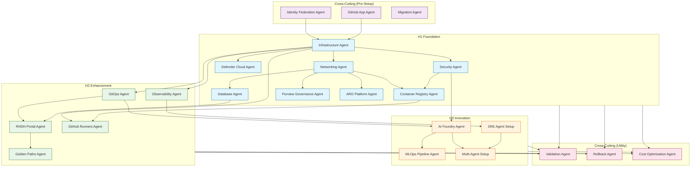

# Agent Dependency Graph

> Visual representation of dependencies between Three Horizons agents

## Overview

This document provides visual dependency maps showing how agents relate to each other and the order in which they must be deployed.

---

## Complete Dependency Tree

```
                              ┌─────────────────────┐
                              │   CROSS-CUTTING     │
                              │  (Pre-Setup Agents) │
                              └─────────────────────┘
                                        │
              ┌─────────────────────────┼─────────────────────────┐
              │                         │                         │
              ▼                         ▼                         ▼
    ┌─────────────────┐      ┌─────────────────┐      ┌─────────────────┐
    │  Identity       │      │  GitHub App     │      │  Migration      │
    │  Federation     │      │  Agent          │      │  Agent          │
    └─────────────────┘      └─────────────────┘      └─────────────────┘
              │                         │
              └───────────┬─────────────┘
                          │
                          ▼
              ┌───────────────────────────────────────────────────────────┐
              │                    H1 FOUNDATION                          │
              └───────────────────────────────────────────────────────────┘
                          │
                          ▼
              ┌─────────────────┐
              │ Infrastructure  │ ◄── Entry Point
              │ Agent           │
              └─────────────────┘
                          │
          ┌───────────────┼───────────────┐
          │               │               │
          ▼               ▼               ▼
┌─────────────────┐ ┌─────────────┐ ┌─────────────────┐
│ Networking      │ │ Security    │ │ Defender        │
│ Agent           │ │ Agent       │ │ Cloud Agent     │
└─────────────────┘ └─────────────┘ └─────────────────┘
          │               │
          │               │
          ▼               ▼
┌─────────────────┐ ┌─────────────────┐
│ Container       │ │ Database        │
│ Registry Agent  │ │ Agent           │
└─────────────────┘ └─────────────────┘
          │
          │    ┌─────────────────┐    ┌─────────────────┐
          │    │ Purview         │    │ ARO Platform    │
          │    │ Governance      │    │ Agent           │
          │    │ (Optional)      │    │ (Alternative)   │
          │    └─────────────────┘    └─────────────────┘
          │
          ▼
┌───────────────────────────────────────────────────────────┐
│                    H2 ENHANCEMENT                         │
└───────────────────────────────────────────────────────────┘
          │
          ├─────────────────────────────────────┐
          │                                     │
          ▼                                     ▼
┌─────────────────┐               ┌─────────────────┐
│ GitOps          │               │ Observability   │
│ Agent           │               │ Agent           │
└─────────────────┘               └─────────────────┘
          │                                     │
          │                                     │
          ▼                                     │
┌─────────────────┐                             │
│ RHDH Portal     │                             │
│ Agent           │                             │
└─────────────────┘                             │
          │                                     │
          ▼                                     │
┌─────────────────┐               ┌─────────────────┐
│ Golden Paths    │               │ GitHub Runners  │
│ Agent           │               │ Agent           │
└─────────────────┘               └─────────────────┘
          │                                     │
          └─────────────┬───────────────────────┘
                        │
                        ▼
          ┌───────────────────────────────────────────────────────────┐
          │                    H3 INNOVATION                          │
          └───────────────────────────────────────────────────────────┘
                        │
          ┌─────────────┼─────────────┐
          │             │             │
          ▼             ▼             ▼
┌─────────────────┐ ┌─────────────┐ ┌─────────────────┐
│ AI Foundry      │ │ SRE Agent   │ │ MLOps Pipeline  │
│ Agent           │ │ Setup       │ │ Agent           │
└─────────────────┘ └─────────────┘ └─────────────────┘
          │             │
          └──────┬──────┘
                 │
                 ▼
        ┌─────────────────┐
        │ Multi-Agent     │
        │ Setup           │
        └─────────────────┘
```

---

## Mermaid Diagram



---

## Dependency Matrix

### H1 Foundation Dependencies

| Agent | Depends On | Required By |
|-------|------------|-------------|
| Infrastructure | - | All H1, H2, H3 |
| Networking | Infrastructure | ACR, Database, Purview, ARO |
| Security | Infrastructure | ACR, AI Foundry |
| Container Registry | Networking, Security | GitHub Runners |
| Database | Networking | RHDH Portal |
| Defender Cloud | Infrastructure | - |
| Purview Governance | Networking | - |
| ARO Platform | Networking | (Alternative to AKS) |

### H2 Enhancement Dependencies

| Agent | Depends On | Required By |
|-------|------------|-------------|
| GitOps | Infrastructure | RHDH, AI Foundry |
| Observability | Infrastructure | SRE Agent |
| RHDH Portal | GitOps, Database | Golden Paths |
| Golden Paths | RHDH Portal | - |
| GitHub Runners | Infrastructure, ACR | - |

### H3 Innovation Dependencies

| Agent | Depends On | Required By |
|-------|------------|-------------|
| AI Foundry | Security, GitOps | MLOps, Multi-Agent |
| MLOps Pipeline | AI Foundry | - |
| SRE Agent | Observability | Multi-Agent |
| Multi-Agent | AI Foundry, SRE | - |

### Cross-Cutting Dependencies

| Agent | Depends On | When to Run |
|-------|------------|-------------|
| Identity Federation | - | Before H1 or anytime |
| GitHub App | - | Before using GitHub features |
| Migration | - | During ADO to GitHub transition |
| Validation | H1+ | After any deployment |
| Rollback | H1+ | Emergency recovery |
| Cost Optimization | H1+ | Post-deployment review |

---

## Parallel Deployment Opportunities

Some agents can be deployed in parallel to reduce total deployment time:

### Phase 1 Parallel Groups

```
Group 1A (Serial - Core):
  Infrastructure → Networking → Security

Group 1B (Parallel after Networking):
  ├── Container Registry
  ├── Database
  └── Defender Cloud

Group 1C (Parallel - Optional):
  ├── Purview Governance
  └── ARO Platform
```

### Phase 2 Parallel Groups

```
Group 2A (Parallel after H1):
  ├── GitOps Agent
  ├── Observability Agent
  └── GitHub Runners Agent

Group 2B (After GitOps):
  └── RHDH Portal Agent

Group 2C (After RHDH):
  └── Golden Paths Agent
```

### Phase 3 Parallel Groups

```
Group 3A (Parallel after H2):
  ├── AI Foundry Agent
  └── SRE Agent Setup

Group 3B (After AI Foundry):
  ├── MLOps Pipeline Agent
  └── Multi-Agent Setup
```

---

## Critical Path

The critical path (longest sequential dependency chain) is:

```
Infrastructure → Networking → Security → Container Registry →
GitOps → RHDH Portal → Golden Paths → AI Foundry → Multi-Agent Setup
```

**Estimated Critical Path Time:** 130-175 minutes

---

## Dependency Validation

Run the validation script to check dependencies:

```bash
./scripts/validate-agents.sh --verbose
```

This will check:
- All required agents exist
- Dependencies are properly documented
- Cross-references are valid

---

## JSON Dependency Graph

For programmatic access, here's the dependency graph in JSON format:

```json
{
  "agents": {
    "infrastructure-agent": {
      "horizon": "h1",
      "depends_on": [],
      "required_by": ["networking-agent", "security-agent", "defender-cloud-agent", "gitops-agent", "observability-agent", "github-runners-agent"]
    },
    "networking-agent": {
      "horizon": "h1",
      "depends_on": ["infrastructure-agent"],
      "required_by": ["container-registry-agent", "database-agent", "purview-governance-agent", "aro-platform-agent"]
    },
    "security-agent": {
      "horizon": "h1",
      "depends_on": ["infrastructure-agent"],
      "required_by": ["container-registry-agent", "ai-foundry-agent"]
    },
    "container-registry-agent": {
      "horizon": "h1",
      "depends_on": ["networking-agent", "security-agent"],
      "required_by": ["github-runners-agent"]
    },
    "database-agent": {
      "horizon": "h1",
      "depends_on": ["networking-agent"],
      "required_by": ["rhdh-portal-agent"]
    },
    "defender-cloud-agent": {
      "horizon": "h1",
      "depends_on": ["infrastructure-agent"],
      "required_by": []
    },
    "purview-governance-agent": {
      "horizon": "h1",
      "depends_on": ["networking-agent"],
      "required_by": []
    },
    "aro-platform-agent": {
      "horizon": "h1",
      "depends_on": ["networking-agent"],
      "required_by": []
    },
    "gitops-agent": {
      "horizon": "h2",
      "depends_on": ["infrastructure-agent"],
      "required_by": ["rhdh-portal-agent", "ai-foundry-agent"]
    },
    "observability-agent": {
      "horizon": "h2",
      "depends_on": ["infrastructure-agent"],
      "required_by": ["sre-agent-setup"]
    },
    "rhdh-portal-agent": {
      "horizon": "h2",
      "depends_on": ["gitops-agent", "database-agent"],
      "required_by": ["golden-paths-agent"]
    },
    "golden-paths-agent": {
      "horizon": "h2",
      "depends_on": ["rhdh-portal-agent"],
      "required_by": []
    },
    "github-runners-agent": {
      "horizon": "h2",
      "depends_on": ["infrastructure-agent", "container-registry-agent"],
      "required_by": []
    },
    "ai-foundry-agent": {
      "horizon": "h3",
      "depends_on": ["security-agent", "gitops-agent"],
      "required_by": ["mlops-pipeline-agent", "multi-agent-setup"]
    },
    "mlops-pipeline-agent": {
      "horizon": "h3",
      "depends_on": ["ai-foundry-agent"],
      "required_by": []
    },
    "sre-agent-setup": {
      "horizon": "h3",
      "depends_on": ["observability-agent"],
      "required_by": ["multi-agent-setup"]
    },
    "multi-agent-setup": {
      "horizon": "h3",
      "depends_on": ["ai-foundry-agent", "sre-agent-setup"],
      "required_by": []
    },
    "validation-agent": {
      "horizon": "cross-cutting",
      "depends_on": [],
      "required_by": []
    },
    "migration-agent": {
      "horizon": "cross-cutting",
      "depends_on": [],
      "required_by": []
    },
    "rollback-agent": {
      "horizon": "cross-cutting",
      "depends_on": [],
      "required_by": []
    },
    "cost-optimization-agent": {
      "horizon": "cross-cutting",
      "depends_on": [],
      "required_by": []
    },
    "github-app-agent": {
      "horizon": "cross-cutting",
      "depends_on": [],
      "required_by": []
    },
    "identity-federation-agent": {
      "horizon": "cross-cutting",
      "depends_on": [],
      "required_by": []
    }
  }
}
```

---

## Next Steps

After understanding dependencies:

1. **Start deployment** - Follow [DEPLOYMENT_SEQUENCE.md](./DEPLOYMENT_SEQUENCE.md)
2. **Setup MCP servers** - See [MCP_SERVERS_GUIDE.md](./MCP_SERVERS_GUIDE.md)
3. **Check Terraform modules** - View [TERRAFORM_MODULES_REFERENCE.md](./TERRAFORM_MODULES_REFERENCE.md)
4. **Validate agents** - Run `./scripts/validate-agents.sh`
5. **Browse agents** - Check the [INDEX.md](./INDEX.md) for details

---

## Related Documentation

### Agent Documentation
- [README.md](./README.md) - Agents overview
- [INDEX.md](./INDEX.md) - Complete agent index
- [DEPLOYMENT_SEQUENCE.md](./DEPLOYMENT_SEQUENCE.md) - Deployment order
- [MCP_SERVERS_GUIDE.md](./MCP_SERVERS_GUIDE.md) - MCP server setup
- [TERRAFORM_MODULES_REFERENCE.md](./TERRAFORM_MODULES_REFERENCE.md) - Terraform modules

### Main Guides
- [Architecture Guide](../docs/guides/ARCHITECTURE_GUIDE.md) - Three Horizons architecture
- [Deployment Guide](../docs/guides/DEPLOYMENT_GUIDE.md) - Full deployment instructions
- [Troubleshooting Guide](../docs/guides/TROUBLESHOOTING_GUIDE.md) - Problem resolution

---

**Version:** 4.0.0
**Last Updated:** December 2025
