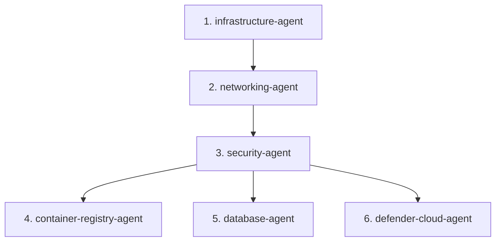
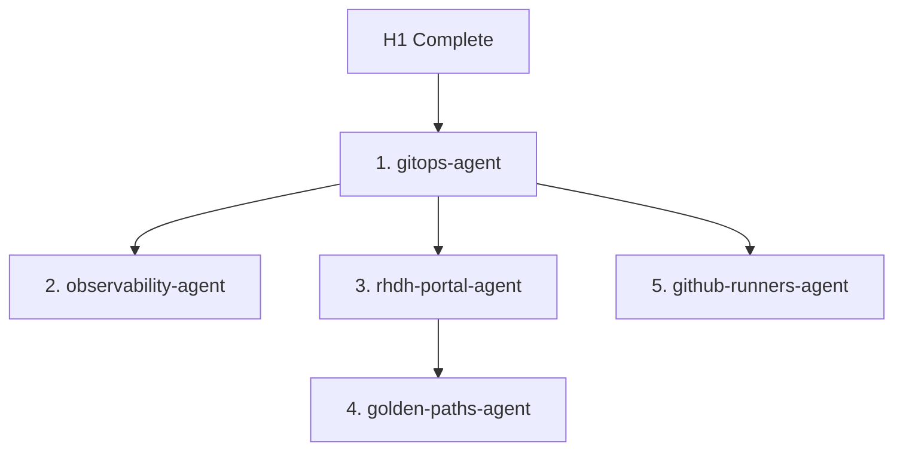
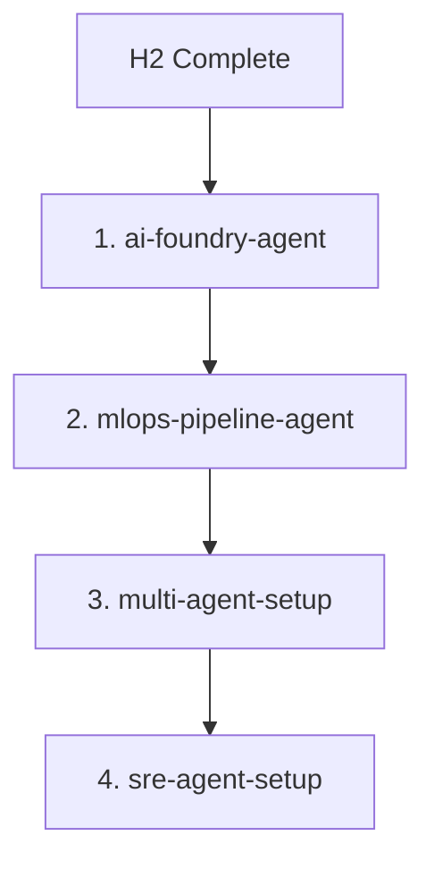

# Three Horizons Agents v2.0 - Quick Start Guide

> **Updated:** February 2, 2026  
> **Based on:** GitHub Agentic Workflows patterns

---

## 🚀 What's New in v2.0

### Major Changes

✅ **Real Skills Integration** - No more fictional MCP servers  
✅ **Explicit Consent Patterns** - Security-first approach  
✅ **GitHub Agentic Workflows** - Natural language workflow definitions  
✅ **Best Practices Built-in** - Terraform, Azure, Kubernetes standards

---

## 📦 Prerequisites

### Required Tools

```bash
# Verify installations
az version        # >= 2.50.0
terraform version # >= 1.5.0
kubectl version   # >= 1.28
gh --version      # >= 2.30
helm version      # >= 3.12
argocd version    # >= 2.9

# Install missing tools
brew install azure-cli terraform kubectl gh helm argocd
```

### Azure Authentication

```bash
# Login to Azure
az login

# Set subscription
az account set --subscription "YOUR_SUBSCRIPTION_ID"

# Verify
az account show
```

### GitHub Authentication

```bash
# Login to GitHub CLI
gh auth login

# Verify
gh auth status
```

---

## 🎯 Using Agents

### Method 1: GitHub Issues (Recommended)

**Trigger agents by creating GitHub issues with specific labels:**

```bash
# Example: Deploy H1 Foundation Infrastructure
gh issue create \
  --title "Deploy H1 Foundation Infrastructure" \
  --label "agent:infrastructure-agent" \
  --label "horizon:h1" \
  --body "
## Deployment Request

**Environment:** production
**Region:** brazilsouth
**Sizing Profile:** medium

## Configuration

\`\`\`yaml
project_name: threehorizons
environment: prd
location: brazilsouth
sizing_profile: medium
\`\`\`

## Checklist

- [ ] Azure subscription configured
- [ ] Terraform backend setup
- [ ] Naming conventions validated
"
```

**Agent workflow**:
1. ✅ Issue created with label `agent:infrastructure-agent`
2. 🤖 GitHub Actions workflow triggered
3. 📋 Agent validates prerequisites
4. 📄 Agent runs `terraform plan`
5. ⏸️ **Agent requests approval** (human-in-the-loop)
6. ✅ User approves via issue comment: `/approve`
7. 🚀 Agent runs `terraform apply`
8. 📊 Agent posts results as issue comment
9. ✅ Issue automatically closed on success

### Method 2: GitHub Actions Workflow Dispatch

**Trigger agents manually via GitHub Actions UI:**

1. Go to **Actions** tab in GitHub
2. Select workflow (e.g., "Infrastructure Deploy")
3. Click "Run workflow"
4. Fill in parameters
5. Click "Run workflow"

### Method 3: Command Line (Direct)

**Run agent scripts directly on your machine:**

```bash
# 1. Clone repository
git clone https://github.com/YOUR_ORG/three-horizons-accelerator-v4.git
cd three-horizons-accelerator-v4

# 2. Validate prerequisites
./scripts/validate-cli-prerequisites.sh

# 3. Run agent script (example: infrastructure)
cd terraform
terraform init
terraform plan -out=tfplan

# 4. Review plan and confirm
terraform show tfplan

# 5. Apply (requires manual confirmation)
terraform apply tfplan
```

---

## 🔄 Deployment Sequence

### Phase 1: H1 Foundation (Required First)

Deploy in this exact order:



**Commands**:

```bash
# 1. Infrastructure (AKS, ACR, Key Vault)
gh issue create --title "Deploy Infrastructure" --label "agent:infrastructure-agent"

# 2. Networking (VNets, NSGs, Private Endpoints)
gh issue create --title "Deploy Networking" --label "agent:networking-agent"

# 3. Security (Workload Identity, RBAC)
gh issue create --title "Configure Security" --label "agent:security-agent"

# 4. Container Registry (ACR)
gh issue create --title "Setup ACR" --label "agent:container-registry-agent"

# 5. Databases (PostgreSQL, Redis)
gh issue create --title "Deploy Databases" --label "agent:database-agent"

# 6. Defender for Cloud
gh issue create --title "Enable Defender" --label "agent:defender-cloud-agent"
```

### Phase 2: H2 Enhancement (After H1)



**Commands**:

```bash
# 1. GitOps (ArgoCD)
gh issue create --title "Deploy GitOps" --label "agent:gitops-agent"

# 2. Observability (Prometheus, Grafana)
gh issue create --title "Deploy Observability" --label "agent:observability-agent"

# 3. Developer Portal (RHDH)
gh issue create --title "Deploy RHDH" --label "agent:rhdh-portal-agent"

# 4. Golden Paths (Templates)
gh issue create --title "Setup Golden Paths" --label "agent:golden-paths-agent"

# 5. GitHub Runners (Self-hosted)
gh issue create --title "Deploy Runners" --label "agent:github-runners-agent"
```

### Phase 3: H3 Innovation (After H2)



**Commands**:

```bash
# 1. AI Foundry (Azure AI)
gh issue create --title "Deploy AI Foundry" --label "agent:ai-foundry-agent"

# 2. MLOps Pipeline
gh issue create --title "Setup MLOps" --label "agent:mlops-pipeline-agent"

# 3. Multi-Agent Setup
gh issue create --title "Configure Multi-Agent" --label "agent:multi-agent-setup"

# 4. SRE Agent
gh issue create --title "Deploy SRE Agent" --label "agent:sre-agent-setup"
```

---

## 🛡️ Security & Consent

### Explicit Consent Pattern

**All agents follow security-first principles:**

1. **Read-only by default** - Agents can read configuration, check status, validate
2. **Explicit consent required** - Destructive operations require user approval
3. **Safe-outputs only** - Write operations use sanitized outputs
4. **Human-in-the-loop** - Critical operations need manual approval

**Example interaction**:

```
🤖 Agent: I've planned the infrastructure deployment. Here's what will be created:

Resources to create:
  + azurerm_kubernetes_cluster.main
  + azurerm_virtual_network.main
  + azurerm_subnet.aks
  + azurerm_container_registry.main
  + azurerm_key_vault.main
  (... 42 more resources)

Total: 47 resources to add, 0 to change, 0 to destroy.

⚠️ This will create resources in subscription 'prod-subscription' (12345678-1234-1234-1234-123456789012)

Should I proceed with terraform apply? (yes/no)

👤 User: yes

🤖 Agent: Confirmed. Applying changes...
✅ Apply complete! Resources: 47 added, 0 changed, 0 destroyed.
```

### Consent Commands

**In issue comments or workflow approvals**:

```bash
# Approve
/approve
/yes
/confirm

# Reject
/reject
/no
/cancel

# Review
/review
/show plan
/dry-run
```

---

## 📊 Monitoring & Validation

### Health Checks

**After each deployment, agents automatically run validation**:

```bash
# Validation scripts used by agents
.github/skills/validation-scripts/validate-azure-resources.sh
.github/skills/validation-scripts/validate-k8s-cluster.sh
.github/skills/validation-scripts/validate-terraform-state.sh
.github/skills/validation-scripts/detect-drift.sh
```

**Manual validation**:

```bash
# Validate full deployment
gh issue create --title "Validate Platform" --label "agent:validation-agent"

# Or run scripts directly
./scripts/validate-deployment.sh
```

### Observability

**Access monitoring dashboards**:

```bash
# Get Grafana URL
kubectl get ingress -n monitoring grafana -o jsonpath='{.status.loadBalancer.ingress[0].ip}'

# Get Prometheus URL
kubectl get svc -n monitoring prometheus -o jsonpath='{.status.loadBalancer.ingress[0].ip}'

# Get ArgoCD URL
kubectl get svc -n argocd argocd-server -o jsonpath='{.status.loadBalancer.ingress[0].ip}'
```

---

## 🚨 Troubleshooting

### Agent Stuck or Failed

**Check agent status**:

```bash
# View GitHub Actions logs
gh run list --workflow "Infrastructure Deploy"
gh run view <run-id> --log

# Check terraform state
cd terraform
terraform state list
terraform show
```

**Rollback if needed**:

```bash
# Trigger rollback agent
gh issue create \
  --title "Rollback Infrastructure" \
  --label "agent:rollback-agent" \
  --body "Rollback to previous successful deployment"
```

### Validation Failures

**Common issues and solutions**:

| Issue | Solution |
|-------|----------|
| AKS cluster not ready | Wait 5-10 minutes, run validation again |
| ACR not accessible | Check NSG rules, verify private endpoint |
| Key Vault access denied | Verify RBAC assignments, check managed identity |
| Terraform state locked | Run `terraform force-unlock <lock-id>` |

### Permission Errors

**Azure RBAC**:

```bash
# Check current permissions
az role assignment list --assignee $(az ad signed-in-user show --query id -o tsv)

# Required roles:
# - Owner or Contributor (subscription level)
# - User Access Administrator (for RBAC assignments)
```

**Kubernetes RBAC**:

```bash
# Check permissions
kubectl auth can-i create deployments -n default

# Get cluster admin credentials
az aks get-credentials --name aks-threehorizons-prd-brs --resource-group rg-threehorizons-prd-brs --admin
```

---

## 📚 Documentation

### Agent Documentation

- [Agent Template](AGENT_TEMPLATE.md) - v2.0 template for new agents
- [Validation Report](AGENT_VALIDATION_REPORT.md) - Compliance analysis
- [Integration Guide](AGENT_INTEGRATION_GUIDE.md) - Multi-agent orchestration
- [Update Summary](AGENTS_V2_UPDATE_SUMMARY.md) - v2.0 changes

### Skills Documentation

- [terraform-cli](.github/skills/terraform-cli/SKILL.md) - Terraform operations
- [azure-cli](.github/skills/azure-cli/SKILL.md) - Azure CLI commands
- [kubectl-cli](.github/skills/kubectl-cli/SKILL.md) - Kubernetes operations
- [argocd-cli](.github/skills/argocd-cli/SKILL.md) - ArgoCD CLI
- [helm-cli](.github/skills/helm-cli/SKILL.md) - Helm operations
- [github-cli](.github/skills/github-cli/SKILL.md) - GitHub API operations

### External References

- [GitHub Agentic Workflows](https://githubnext.com/projects/agentic-workflows/)
- [Azure Verified Modules](https://registry.terraform.io/namespaces/Azure)
- [Terraform Best Practices](https://www.terraform-best-practices.com/)
- [Azure Well-Architected Framework](https://learn.microsoft.com/azure/well-architected/)

---

## 🤝 Contributing

### Creating New Agents

**Use the v2.0 template**:

```bash
# 1. Copy template
cp agents/AGENT_TEMPLATE.md agents/h1-foundation/my-new-agent.md

# 2. Customize
# - Update name, version, skills, dependencies
# - Add capabilities
# - Define workflow
# - Add validation steps

# 3. Test locally
./scripts/validate-agents.sh

# 4. Create PR
git checkout -b feature/my-new-agent
git add agents/h1-foundation/my-new-agent.md
git commit -m "Add my-new-agent"
git push origin feature/my-new-agent
gh pr create
```

### Updating Existing Agents

**Follow v2.0 standards**:

1. ✅ Use `skills` (not `mcp_servers`)
2. ✅ Add "Explicit Consent Required" section
3. ✅ Include validation patterns
4. ✅ Add best practices (Terraform, Azure, etc.)
5. ✅ Update version to 2.x.x
6. ✅ Update `last_updated` date

---

## 📞 Support

### Get Help

- **GitHub Issues**: [Create an issue](https://github.com/YOUR_ORG/three-horizons-accelerator-v4/issues/new)
- **GitHub Discussions**: [Start a discussion](https://github.com/YOUR_ORG/three-horizons-accelerator-v4/discussions)
- **Internal Slack**: #3horizons-platform

### Escalation

For critical issues:
1. Create high-priority issue with label `priority:critical`
2. Notify on-call SRE: `@sre-on-call`
3. Run rollback agent if needed

---

**Quick Start Guide Version:** 1.0.0  
**Last Updated:** February 2, 2026  
**Agents Version:** v2.0.x
