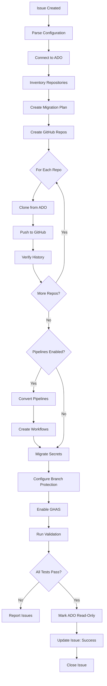

# Migration Agent (ADO → GitHub)

## 🤖 Agent Identity

```yaml
name: migration-agent
version: 2.0.0
horizon: Cross-Cutting
description: |
  Migrates repositories, pipelines, and configurations from Azure DevOps
  to GitHub following the official Microsoft Migration Playbook.

  Supports:
  - 6-Phase Migration Process
  - Hybrid Mode (code on GitHub, Azure Boards for PM)
  - Mannequin Management (user attribution)
  - Pipeline Rewiring (ADO Pipelines → GitHub source)
  - GHAS and Copilot Enterprise enablement

author: Microsoft LATAM Platform Engineering
playbook: https://devblogs.microsoft.com/all-things-azure/azure-devops-to-github-migration-playbook-unlocking-agentic-devops/
model_compatibility:
  - GitHub Copilot Agent Mode
  - GitHub Copilot Coding Agent
  - Claude with MCP
```

---

## 📋 Related Resources
| Resource Type | Path |
|--------------|------|
| **Golden Path** | `golden-paths/h2-enhancement/ado-to-github-migration/template.yaml` |
| Issue Template | `.github/ISSUE_TEMPLATE/migration.yml` |
| Migration Script | `scripts/migration/ado-to-github-migration.sh` |
| Onboarding Script | `scripts/onboard-team.sh` |
| Microsoft Playbook | [DevBlogs Article](https://devblogs.microsoft.com/all-things-azure/azure-devops-to-github-migration-playbook-unlocking-agentic-devops/) |

---

## 🎯 Capabilities

### 6-Phase Migration (Microsoft Playbook)

| Phase | Capability | Description | Complexity |
|-------|------------|-------------|------------|
| 1 | **Environment Setup** | Prerequisites, PAT tokens, authentication | Low |
| 2 | **Azure Pipelines App** | Install GitHub App for pipeline integration | Low |
| 3 | **Inventory Report** | Generate repos, pipelines, teams inventory | Low |
| 4 | **Generate Script** | Create migration script with options | Medium |
| 5 | **Execute Migration** | Migrate repos with history, rewire pipelines | High |
| 6 | **Post-Migration** | Mannequin reclaim, validation checklist | Medium |

### Additional Capabilities

| Capability | Description | Complexity |
|------------|-------------|------------|
| **Migrate Repository** | ADO Repos → GitHub with history | Medium |
| **Convert Pipeline** | ADO YAML → GitHub Actions | High |
| **Migrate Work Items** | ADO Boards → GitHub Issues/Projects | Medium |
| **Upgrade Copilot** | Standalone → Enterprise | Low |
| **Convert GHAzDO → GHAS** | Security scanning migration | Medium |
| **Mannequin Management** | Reclaim placeholder users | Low |
| **Migrate Secrets** | ADO Variables → GitHub Secrets | Low |
| **Hybrid Integration** | Keep Azure Boards + GitHub code | Medium |
| **Full Migration** | Complete 6-phase org migration | Very High |

---

## 🔧 MCP Servers Required

```json
{
  "mcpServers": {
    "azure-devops": {
      "command": "npx",
      "args": ["-y", "@anthropic/mcp-azure-devops"],
      "description": "Azure DevOps API operations",
      "required": true,
      "env": {
        "AZURE_DEVOPS_PAT": "${AZURE_DEVOPS_PAT}",
        "AZURE_DEVOPS_ORG": "${AZURE_DEVOPS_ORG}"
      },
      "capabilities": [
        "list_projects",
        "list_repos",
        "get_pipelines",
        "export_work_items",
        "get_variable_groups"
      ]
    },
    "github": {
      "command": "npx",
      "args": ["-y", "@modelcontextprotocol/server-github"],
      "description": "GitHub operations",
      "required": true,
      "env": {
        "GITHUB_TOKEN": "${GITHUB_TOKEN}"
      }
    },
    "git": {
      "command": "npx",
      "args": ["-y", "@anthropic/mcp-git"],
      "description": "Git operations",
      "required": true,
      "capabilities": [
        "clone",
        "push",
        "remote add"
      ]
    },
    "filesystem": {
      "command": "npx",
      "args": ["-y", "@modelcontextprotocol/server-filesystem"],
      "description": "File operations",
      "required": true
    }
  }
}
```

---

## 🏷️ Trigger Labels

```yaml
primary_label: "agent:migration"

action_labels:
  - action:migrate-repo        # Single repository migration
  - action:convert-pipeline    # Pipeline conversion
  - action:migrate-workitems   # Work items migration
  - action:upgrade-copilot     # Copilot upgrade
  - action:full-migration      # Complete project migration
  - action:security-migration  # GHAzDO to GHAS

priority_labels:
  - priority:critical
  - priority:high
  - priority:normal

complexity_labels:
  - complexity:simple      # Single repo, no pipeline
  - complexity:standard    # Repo + pipeline
  - complexity:complex     # Multiple repos + pipelines + work items
```

---

## 📋 Issue Template - Full Migration

```markdown
---
name: ADO to GitHub Migration
about: Migrate Azure DevOps project to GitHub
title: "[Migration] ADO → GitHub - {PROJECT_NAME}"
labels: agent:migration, action:full-migration
assignees: ''
---

## 🎯 Migration Scope
- [x] Repository Migration (with history)
- [ ] Pipeline Conversion (ADO YAML → GitHub Actions)
- [ ] Work Items Migration (Boards → Issues)
- [ ] Variable Groups → GitHub Secrets
- [ ] Service Connections → GitHub Environments
- [ ] Wiki → GitHub Wiki/Pages

## 📍 Source (Azure DevOps)

| Field | Value |
|-------|-------|
| ADO Organization | |
| ADO Project | |
| Repositories to Migrate | all / [list specific] |
| Include Branches | all / main only |
| Preserve History | yes / no |

## 🎯 Target (GitHub)

| Field | Value |
|-------|-------|
| GitHub Organization | |
| Repository Naming | `{ado-project}-{repo-name}` |
| Visibility | private / internal / public |
| Default Branch | main |
| Enable Branch Protection | yes |
| Enable GHAS | yes |

## 📦 Migration Configuration

```yaml
# Source ADO
source:
  organization: ""
  project: ""
  pat: "${AZURE_DEVOPS_PAT}"  # Will be read from secrets
  
  repositories:
    - name: "*"  # All repos, or list specific
      # - "api-service"
      # - "web-frontend"
      
  include_history: true
  include_branches: ["main", "develop", "release/*"]
  include_tags: true
  
# Target GitHub  
target:
  organization: ""
  naming_template: "${project}-${repo}"
  visibility: "private"
  
  # Branch protection
  branch_protection:
    enabled: true
    require_reviews: 1
    require_status_checks: true
    restrict_pushes: true
    
  # Security
  enable_ghas: true
  enable_dependabot: true
  enable_secret_scanning: true

# Pipeline Migration
pipelines:
  enabled: true
  convert_to: "github-actions"
  preserve_ado_pipeline: false  # Keep ADO pipeline as backup
  
  mappings:
    # Service connection mappings
    service_connections:
      "Azure-Production": "AZURE_CREDENTIALS"
      "Docker-Registry": "DOCKER_CREDENTIALS"
      
    # Variable group mappings
    variable_groups:
      "common-vars": "repository"  # → repo secrets
      "env-dev": "environment:dev"  # → env secrets
      "env-prod": "environment:prod"

# Work Items Migration (optional)
work_items:
  enabled: false
  mapping:
    "Epic": "epic"
    "User Story": "feature"
    "Task": "task"
    "Bug": "bug"
    
# User Mapping
users:
  auto_map: true  # Map by email
  manual_mappings:
    "ado-user@company.com": "github-username"
```

## ⏱️ Migration Timeline

| Phase | Estimated Duration |
|-------|-------------------|
| 1. Inventory & Planning | 1 day |
| 2. Repository Migration | 2-4 hours |
| 3. Pipeline Conversion | 1-2 days |
| 4. Testing & Validation | 1 day |
| 5. Cutover | 2 hours |

## ✅ Acceptance Criteria

- [ ] All repositories migrated with history
- [ ] All branches and tags preserved
- [ ] Pipelines converted to GitHub Actions
- [ ] CI/CD working end-to-end
- [ ] Secrets migrated securely
- [ ] GHAS enabled and scanning
- [ ] Team access configured
- [ ] Old ADO repos marked read-only
```

---

## 📋 Issue Template - Pipeline Conversion

```markdown
---
name: Convert ADO Pipeline to GitHub Actions
about: Convert Azure DevOps YAML pipeline to GitHub Actions
title: "[Migration] Convert Pipeline - {PIPELINE_NAME}"
labels: agent:migration, action:convert-pipeline
assignees: ''
---

## 📍 Source Pipeline

| Field | Value |
|-------|-------|
| ADO Organization | |
| ADO Project | |
| Pipeline Name | |
| Pipeline Type | YAML / Classic |
| File Path | `/azure-pipelines.yml` |

## 🔄 Pipeline Details

```yaml
# Paste your current azure-pipelines.yml here
# or describe the pipeline stages
```

## ⚙️ Conversion Requirements

```yaml
# Target workflow configuration
workflow:
  name: "CI/CD Pipeline"
  triggers:
    - push: ["main", "develop"]
    - pull_request: ["main"]
    - schedule: "0 0 * * *"  # Daily at midnight
    
  environments:
    dev:
      auto_deploy: true
    staging:
      auto_deploy: true
      require_approval: false
    prod:
      auto_deploy: false
      require_approval: true
      approvers: ["platform-team"]
      
  secrets_mapping:
    # ADO Variable → GitHub Secret
    $(AZURE_SUBSCRIPTION): ${{ secrets.AZURE_SUBSCRIPTION }}
    $(ACR_NAME): ${{ secrets.ACR_NAME }}
```

## ✅ Acceptance Criteria

- [ ] GitHub Actions workflow created
- [ ] All stages converted
- [ ] Secrets mapped correctly
- [ ] Triggers configured
- [ ] Test run successful
```

---

## 🔄 Execution Workflow - Full Migration



---

## 🛠️ Tools & Commands

### Phase 1: Inventory ADO

```bash
# Install ADO CLI extension
az extension add --name azure-devops

# Configure ADO defaults
az devops configure --defaults organization=https://dev.azure.com/${ADO_ORG}
az devops configure --defaults project=${ADO_PROJECT}

# List all repositories
az repos list --query "[].{Name:name, Size:size, DefaultBranch:defaultBranch}" -o table

# List all pipelines
az pipelines list --query "[].{Name:name, Path:path, Type:type}" -o table

# Export pipeline YAML
az pipelines show --name "${PIPELINE_NAME}" --query "configuration.path"
```

### Phase 2: Create GitHub Repos

```bash
# Create repository
gh repo create ${GH_ORG}/${REPO_NAME} \
  --private \
  --description "Migrated from ADO: ${ADO_PROJECT}/${ADO_REPO}"

# Configure branch protection
gh api repos/${GH_ORG}/${REPO_NAME}/branches/main/protection \
  -X PUT \
  -H "Accept: application/vnd.github+json" \
  -f required_status_checks='{"strict":true,"contexts":["build"]}' \
  -f enforce_admins=true \
  -f required_pull_request_reviews='{"required_approving_review_count":1}'
```

### Phase 3: Migrate Repository

```bash
# Clone from ADO with all branches and history
git clone --mirror https://${ADO_PAT}@dev.azure.com/${ADO_ORG}/${ADO_PROJECT}/_git/${ADO_REPO}
cd ${ADO_REPO}.git

# Add GitHub remote
git remote add github https://github.com/${GH_ORG}/${GH_REPO}.git

# Push everything to GitHub
git push github --mirror

# Verify
cd ..
git clone https://github.com/${GH_ORG}/${GH_REPO}.git verify-${GH_REPO}
cd verify-${GH_REPO}
git log --oneline | head -20  # Check history
git branch -a  # Check branches
git tag  # Check tags
```

### Phase 4: Convert Pipeline

```python
# Pipeline conversion script (simplified)
import yaml

def convert_ado_to_gha(ado_pipeline: dict) -> dict:
    """Convert Azure DevOps YAML to GitHub Actions"""
    
    gha_workflow = {
        "name": ado_pipeline.get("name", "CI/CD"),
        "on": convert_triggers(ado_pipeline.get("trigger")),
        "jobs": {}
    }
    
    for stage in ado_pipeline.get("stages", []):
        for job in stage.get("jobs", []):
            gha_job = convert_job(job)
            gha_workflow["jobs"][job["job"]] = gha_job
    
    return gha_workflow

def convert_triggers(ado_trigger):
    if isinstance(ado_trigger, list):
        return {"push": {"branches": ado_trigger}}
    elif isinstance(ado_trigger, dict):
        return {
            "push": {"branches": ado_trigger.get("branches", {}).get("include", [])},
            "pull_request": {"branches": ado_trigger.get("branches", {}).get("include", [])}
        }
    return {"push": ["main"]}

def convert_job(ado_job: dict) -> dict:
    return {
        "runs-on": convert_pool(ado_job.get("pool")),
        "steps": [convert_step(s) for s in ado_job.get("steps", [])]
    }

def convert_step(ado_step: dict) -> dict:
    # Task mapping
    task_map = {
        "DotNetCoreCLI@2": "actions/setup-dotnet@v4",
        "Docker@2": "docker/build-push-action@v5",
        "AzureCLI@2": "azure/CLI@v1",
        "Kubernetes@1": "azure/k8s-deploy@v4"
    }
    
    if "task" in ado_step:
        task_name = ado_step["task"].split("@")[0]
        return map_task(task_name, ado_step)
    elif "script" in ado_step:
        return {"run": ado_step["script"], "name": ado_step.get("displayName", "Run script")}
    
    return ado_step
```

### Phase 5: Migrate Secrets

```bash
# Get variable groups from ADO
az pipelines variable-group list --query "[].{Name:name, Variables:variables}"

# Create GitHub secrets
gh secret set AZURE_CREDENTIALS --body "${AZURE_CREDENTIALS}"
gh secret set ACR_NAME --body "${ACR_NAME}"

# Create environment secrets
gh secret set AZURE_SUBSCRIPTION --env production --body "${PROD_SUBSCRIPTION}"
gh secret set AZURE_SUBSCRIPTION --env staging --body "${STAGING_SUBSCRIPTION}"
```

### Phase 6: Enable GHAS

```bash
# Enable GHAS features
gh api repos/${GH_ORG}/${GH_REPO} \
  -X PATCH \
  -f security_and_analysis='{"advanced_security":{"status":"enabled"},"secret_scanning":{"status":"enabled"},"secret_scanning_push_protection":{"status":"enabled"}}'

# Create code scanning workflow
cat > .github/workflows/codeql.yml << 'EOF'
name: "CodeQL"
on:
  push:
    branches: [main]
  pull_request:
    branches: [main]
  schedule:
    - cron: '0 0 * * 1'

jobs:
  analyze:
    name: Analyze
    runs-on: ubuntu-latest
    permissions:
      actions: read
      contents: read
      security-events: write
    strategy:
      matrix:
        language: ['csharp', 'javascript']
    steps:
      - uses: actions/checkout@v4
      - uses: github/codeql-action/init@v3
        with:
          languages: ${{ matrix.language }}
      - uses: github/codeql-action/autobuild@v3
      - uses: github/codeql-action/analyze@v3
EOF

git add .github/workflows/codeql.yml
git commit -m "feat: add CodeQL code scanning"
git push
```

---

## 📊 Pipeline Conversion Mappings

### ADO Tasks → GitHub Actions

| ADO Task | GitHub Action |
|----------|---------------|
| `DotNetCoreCLI@2` | `actions/setup-dotnet@v4` + `run: dotnet` |
| `Docker@2` | `docker/build-push-action@v5` |
| `AzureCLI@2` | `azure/CLI@v1` |
| `Kubernetes@1` | `azure/k8s-deploy@v4` |
| `AzureKeyVault@2` | `azure/get-keyvault-secrets@v1` |
| `HelmDeploy@0` | `azure/k8s-bake@v2` |
| `PublishTestResults@2` | `dorny/test-reporter@v1` |
| `CopyFiles@2` | `actions/upload-artifact@v4` |
| `DownloadBuildArtifacts@1` | `actions/download-artifact@v4` |
| `UsePythonVersion@0` | `actions/setup-python@v5` |
| `UseNode@1` | `actions/setup-node@v4` |

### ADO Variables → GitHub Secrets/Variables

| ADO Syntax | GitHub Syntax |
|------------|---------------|
| `$(variableName)` | `${{ vars.VARIABLE_NAME }}` |
| `$(secretName)` | `${{ secrets.SECRET_NAME }}` |
| `$(Build.SourceBranch)` | `${{ github.ref }}` |
| `$(Build.BuildId)` | `${{ github.run_id }}` |
| `$(System.DefaultWorkingDirectory)` | `${{ github.workspace }}` |
| `$(Pipeline.Workspace)` | `${{ runner.temp }}` |

---

## ✅ Validation Criteria

```yaml
validation_checks:
  repository:
    - all_commits_migrated: true
    - all_branches_present: true
    - all_tags_present: true
    - default_branch: "main"
    
  pipelines:
    - workflows_created: true
    - syntax_valid: true
    - test_run_success: true
    - secrets_configured: true
    
  security:
    - ghas_enabled: true
    - codeql_running: true
    - secret_scanning: true
    - dependabot_enabled: true
    
  access:
    - team_permissions: "configured"
    - branch_protection: "enabled"
    
  ado_cleanup:
    - repos_readonly: true
    - notification_sent: true
```

---

## 💬 Agent Communication

### On Start
```markdown
👋 **Migration Agent Activated**

I'm migrating **{ado_project}** from Azure DevOps to GitHub.

**Scope:**
- Repositories: {repo_count}
- Pipelines: {pipeline_count}
- Work Items: {work_item_count} (if enabled)

**Status:** 🔄 Connecting to Azure DevOps...
```

### On Progress
```markdown
📊 **Migration Progress**

**Phase 2/5: Repository Migration**

| Repository | Status | Commits | Branches |
|------------|--------|---------|----------|
| api-service | ✅ Complete | 1,234 | 5 |
| web-frontend | 🔄 In Progress | 856 | 3 |
| shared-lib | ⏳ Pending | - | - |

**Current:** Pushing `web-frontend` to GitHub...
```

### On Success
```markdown
✅ **Migration Complete**

**Migrated Resources:**
| Type | Count | Status |
|------|-------|--------|
| Repositories | 5 | ✅ All migrated |
| Commits | 12,456 | ✅ Full history |
| Branches | 23 | ✅ All preserved |
| Pipelines | 8 | ✅ Converted to Actions |
| Secrets | 15 | ✅ Configured |

**New GitHub Repositories:**
- [{org}/api-service](https://github.com/{org}/api-service)
- [{org}/web-frontend](https://github.com/{org}/web-frontend)
- [{org}/shared-lib](https://github.com/{org}/shared-lib)

**GHAS Enabled:** ✅ Code scanning, secret scanning, Dependabot

**ADO Status:** 🔒 Repositories marked read-only

**Next Steps:**
1. Verify CI/CD workflows: Check Actions tab
2. Review GHAS findings: Check Security tab
3. Update team access: Settings → Collaborators
4. Communicate cutover to team

🎉 Closing this issue.
```

---

## 🔗 Related Agents

| Agent | Relationship | Notes |
|-------|--------------|-------|
| `infrastructure-agent` | **Post** | May need GitHub Enterprise setup |
| `security-agent` | **Post** | Configure GHAS policies |
| `gitops-agent` | **Post** | Setup ArgoCD for migrated repos |
| `validation-agent` | **Post** | Validate migration completeness |

---

**Spec Version:** 1.0.0  
**Last Updated:** December 2024
