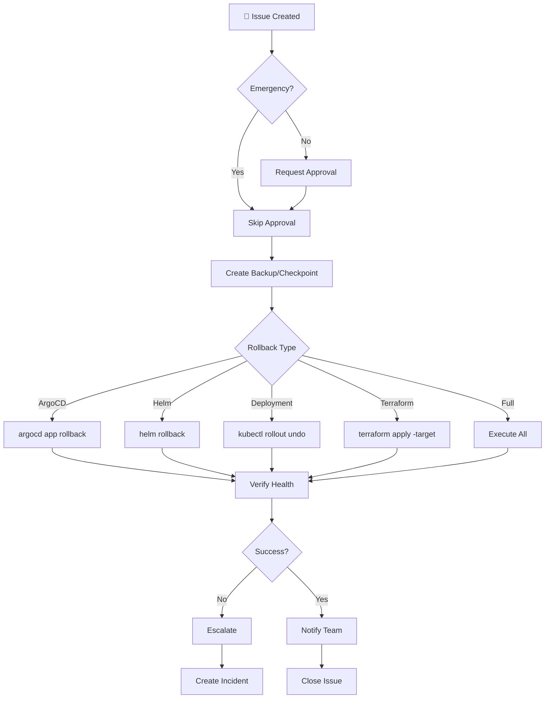

# Rollback Agent

## 🤖 Agent Identity

```yaml
name: rollback-agent
version: 1.0.0
horizon: Cross-Cutting
description: |
  Emergency rollback procedures for failed deployments.
  Can rollback ArgoCD applications, Terraform infrastructure,
  Helm releases, and entire platform components.
  
author: Microsoft LATAM Platform Engineering
model_compatibility:
  - GitHub Copilot Agent Mode
  - GitHub Copilot Coding Agent
  - Claude with MCP
```

---

## 🎯 Capabilities

| Capability | Description | Complexity |
|------------|-------------|------------|
| **Rollback ArgoCD App** | Revert to previous sync | Low |
| **Rollback Helm Release** | Helm rollback | Low |
| **Rollback Terraform** | Revert infrastructure | High |
| **Rollback Deployment** | K8s deployment rollback | Low |
| **Full Platform Rollback** | Complete rollback | Very High |
| **Checkpoint Create** | Save restore point | Medium |
| **Checkpoint Restore** | Restore from checkpoint | Medium |

---

## 🔧 MCP Servers Required

```json
{
  "mcpServers": {
    "kubernetes": {
      "required": true,
      "capabilities": [
        "kubectl rollout undo",
        "kubectl apply"
      ]
    },
    "helm": {
      "required": true,
      "capabilities": [
        "helm rollback",
        "helm history"
      ]
    },
    "argocd": {
      "required": true,
      "capabilities": [
        "argocd app rollback",
        "argocd app history"
      ]
    },
    "terraform": {
      "required": false,
      "capabilities": [
        "terraform state",
        "terraform apply"
      ]
    },
    "github": {
      "required": true
    }
  }
}
```

---

## 🏷️ Trigger Labels

```yaml
primary_label: "agent:rollback"

urgency_labels:
  - urgency:emergency     # Immediate, skip approvals
  - urgency:planned       # Standard with approval

scope_labels:
  - scope:application     # Single app
  - scope:namespace       # All apps in namespace
  - scope:infrastructure  # Terraform resources
  - scope:full-platform   # Everything
```

---

## 📋 Issue Template - Emergency Rollback

```markdown
---
title: "🚨 [EMERGENCY] Rollback - {COMPONENT}"
labels: agent:rollback, urgency:emergency, priority:critical
---

## 🚨 EMERGENCY ROLLBACK REQUEST

### Incident Details
| Field | Value |
|-------|-------|
| Component | |
| Environment | dev / staging / prod |
| Incident Started | YYYY-MM-DD HH:MM UTC |
| Impact | |
| Reported By | |

### Rollback Target

- [ ] ArgoCD Application
- [ ] Helm Release
- [ ] Kubernetes Deployment
- [ ] Terraform Infrastructure
- [ ] Full Platform

### Rollback Configuration

```yaml
rollback:
  type: "argocd"  # argocd, helm, deployment, terraform, full
  
  target:
    name: ""
    namespace: ""
    
  # For ArgoCD
  argocd:
    revision: "HEAD~1"  # or specific commit SHA
    
  # For Helm
  helm:
    revision: 0  # 0 = previous, or specific revision number
    
  # For Terraform
  terraform:
    workspace: ""
    target_state: ""  # state file or specific version
    
  # Safety
  create_backup: true
  notify_team: true
  create_incident: true
```

### Justification
<!-- Why is this rollback needed? -->

### Expected Outcome
<!-- What should be the state after rollback? -->
```

---

## 🔄 Execution Workflow



---

## 🛠️ Rollback Commands

### ArgoCD Rollback

```bash
# View history
argocd app history ${APP_NAME}

# Rollback to previous
argocd app rollback ${APP_NAME}

# Rollback to specific revision
argocd app rollback ${APP_NAME} ${REVISION}

# Force sync after rollback
argocd app sync ${APP_NAME} --force

# Verify
argocd app get ${APP_NAME}
```

### Helm Rollback

```bash
# View history
helm history ${RELEASE_NAME} -n ${NAMESPACE}

# Rollback to previous
helm rollback ${RELEASE_NAME} -n ${NAMESPACE}

# Rollback to specific revision
helm rollback ${RELEASE_NAME} ${REVISION} -n ${NAMESPACE}

# Verify
helm status ${RELEASE_NAME} -n ${NAMESPACE}
```

### Kubernetes Deployment Rollback

```bash
# View rollout history
kubectl rollout history deployment/${DEPLOYMENT} -n ${NAMESPACE}

# Rollback to previous
kubectl rollout undo deployment/${DEPLOYMENT} -n ${NAMESPACE}

# Rollback to specific revision
kubectl rollout undo deployment/${DEPLOYMENT} -n ${NAMESPACE} --to-revision=${REVISION}

# Verify
kubectl rollout status deployment/${DEPLOYMENT} -n ${NAMESPACE}
```

### Terraform Rollback

```bash
# Save current state
terraform state pull > backup-$(date +%Y%m%d-%H%M%S).tfstate

# List state versions (if using remote backend)
az storage blob list --container-name tfstate --query "[?contains(name, 'terraform.tfstate')].{Name:name, Modified:properties.lastModified}"

# Download previous state
az storage blob download --container-name tfstate --name "previous.tfstate" --file previous.tfstate

# Apply previous state
terraform apply -state=previous.tfstate -auto-approve

# Or targeted destroy + recreate
terraform destroy -target=module.problematic_resource -auto-approve
terraform apply -auto-approve
```

---

## 📋 Checkpoint Management

### Create Checkpoint

```bash
# Create checkpoint script
create_checkpoint() {
  CHECKPOINT_ID=$(date +%Y%m%d-%H%M%S)
  CHECKPOINT_DIR="/checkpoints/${PROJECT}/${CHECKPOINT_ID}"
  
  mkdir -p ${CHECKPOINT_DIR}
  
  # Save Terraform state
  terraform state pull > ${CHECKPOINT_DIR}/terraform.tfstate
  
  # Save Helm values
  for release in $(helm list -A -q); do
    helm get values ${release} -n ${ns} > ${CHECKPOINT_DIR}/helm-${release}.yaml
  done
  
  # Save ArgoCD apps
  argocd app list -o yaml > ${CHECKPOINT_DIR}/argocd-apps.yaml
  
  # Save K8s resources
  kubectl get all -A -o yaml > ${CHECKPOINT_DIR}/k8s-resources.yaml
  
  echo "Checkpoint created: ${CHECKPOINT_ID}"
}
```

### Restore Checkpoint

```bash
# Restore checkpoint script
restore_checkpoint() {
  CHECKPOINT_ID=$1
  CHECKPOINT_DIR="/checkpoints/${PROJECT}/${CHECKPOINT_ID}"
  
  # Restore Terraform
  terraform apply -state=${CHECKPOINT_DIR}/terraform.tfstate -auto-approve
  
  # Restore Helm releases
  for values_file in ${CHECKPOINT_DIR}/helm-*.yaml; do
    release=$(basename ${values_file} .yaml | sed 's/helm-//')
    helm upgrade ${release} -f ${values_file} --install
  done
  
  echo "Checkpoint restored: ${CHECKPOINT_ID}"
}
```

---

## ✅ Validation Criteria

```yaml
validation:
  pre_rollback:
    - backup_created: true
    - target_identified: true
    - team_notified: true
    
  post_rollback:
    - pods_running: true
    - services_accessible: true
    - health_checks_pass: true
    - no_error_logs: true
    
  argocd:
    - app_synced: true
    - health_status: "Healthy"
    
  helm:
    - release_deployed: true
    - status: "deployed"
    
  deployment:
    - replicas_available: ">= desired"
    - rollout_complete: true
```

---

## 💬 Agent Communication

### On Emergency Start
```markdown
🚨 **EMERGENCY ROLLBACK INITIATED**

**Target:** ${component}
**Environment:** ${env}
**Type:** ${rollback_type}
**Triggered by:** ${actor}

**Status:** 🔄 Creating backup...

⚠️ Emergency rollback - skipping approval process.
```

### On Success
```markdown
✅ **Rollback Complete**

**Summary:**
| Field | Value |
|-------|-------|
| Component | ${component} |
| Previous State | ${previous_version} |
| Rolled Back To | ${target_version} |
| Duration | ${duration} |

**Health Check:** ✅ All systems healthy

**Backup Location:** ${backup_path}

**Post-Rollback Verification:**
- ✅ Pods running: 3/3
- ✅ Services accessible
- ✅ Health endpoints responding
- ✅ No error logs

**Incident:** Created #INC-${incident_id}

🎉 Closing this issue.
```

### On Failure
```markdown
❌ **Rollback Failed**

**Error:** ${error_message}

**Current State:** ${current_state}

**Manual Steps Required:**
1. Check pod logs: \`kubectl logs -l app=${app} -n ${ns}\`
2. Review events: \`kubectl get events -n ${ns}\`
3. Contact platform team immediately

**Escalating to:** @platform-leads @oncall-team

⚠️ **DO NOT close this issue until resolved.**
```

---

## 🔗 Related Agents

| Agent | Relationship |
|-------|--------------|
| All agents | **Triggered by** failures |
| `validation-agent` | **Post** rollback |
| `sre-agent-setup` | **May trigger** auto-rollback |

---

**Spec Version:** 1.0.0
