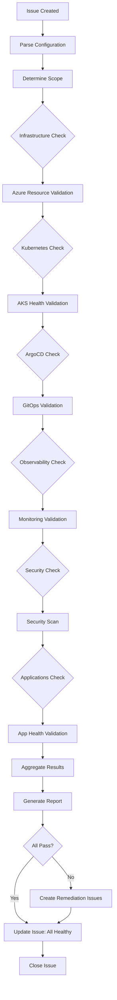

# Validation Agent

## ⚠️ Explicit Consent Required

**User Consent Prompt:**
```markdown
🔍 **Platform Validation Request**

This action will:
- ✅ Scan all Azure resources in subscription
- ✅ Query Kubernetes cluster health
- ✅ Check ArgoCD application status
- ✅ Retrieve security findings (GHAS + Defender)
- ✅ Analyze costs and budget
- ✅ Generate comprehensive validation report

**Validation Scope:**
- Infrastructure: ${INFRA_SCOPE}
- Kubernetes: ${K8S_SCOPE}
- Security: ${SECURITY_SCOPE}
- Cost: ${COST_SCOPE}

**Note:** This is a read-only operation with no destructive changes.

Type **"approve:validation scope={scope}"** to proceed or **"reject"** to cancel.
```

**Approval Format:** `approve:validation scope={all|infra|k8s|security}`

## 🤖 Agent Identity

```yaml
name: validation-agent
version: 1.0.0
horizon: Cross-Cutting
description: |
  Validates infrastructure, deployments, and configurations across all horizons.
  Runs health checks, compliance scans, cost analysis, and generates reports.
  Can be triggered manually or as post-deployment validation.
  
author: Microsoft LATAM Platform Engineering
model_compatibility:
  - GitHub Copilot Agent Mode
  - GitHub Copilot Coding Agent
  - Claude with MCP
```

---

## 📋 Related Resources
| Resource Type | Path |
|--------------|------|
| Issue Template | `.github/ISSUE_TEMPLATE/validation.yml` |
| Validation Script | `scripts/validate-config.sh` |
| Bootstrap Script | `scripts/bootstrap.sh` |
| Prometheus Rules | `prometheus/alerting-rules.yaml` |
| Defender Module | `terraform/modules/defender/main.tf` (compliance checks) |

---

## 🎯 Capabilities

| Capability | Description | Complexity |
|------------|-------------|------------|
| **Infrastructure Validation** | Verify Terraform state matches reality | Medium |
| **AKS Health Check** | Node status, pod health, networking | Low |
| **ArgoCD Validation** | Sync status, app health | Low |
| **Security Scan** | GHAS alerts, Defender findings | Medium |
| **Cost Analysis** | Current vs estimated spend | Low |
| **Compliance Check** | Policy compliance verification | Medium |
| **Performance Test** | Load testing, latency checks | High |
| **Full Platform Audit** | Complete platform validation | High |

---

## 🔧 MCP Servers Required

```json
{
  "mcpServers": {
    "azure": {
      "command": "npx",
      "args": ["-y", "@anthropic/mcp-azure"],
      "description": "Azure resource validation",
      "required": true
    },
    "kubernetes": {
      "command": "npx",
      "args": ["-y", "@anthropic/mcp-kubernetes"],
      "description": "Kubernetes health checks",
      "required": true
    },
    "terraform": {
      "command": "npx",
      "args": ["-y", "@anthropic/mcp-terraform"],
      "description": "Terraform state validation",
      "required": true
    },
    "prometheus": {
      "command": "npx",
      "args": ["-y", "@anthropic/mcp-prometheus"],
      "description": "Metrics validation",
      "required": false
    },
    "github": {
      "command": "npx",
      "args": ["-y", "@modelcontextprotocol/server-github"],
      "description": "GHAS and repo validation",
      "required": true,
      "env": {
        "GITHUB_TOKEN": "${GITHUB_TOKEN}"
      }
    }
  }
}
```

---

## 🏷️ Trigger Labels

```yaml
primary_label: "agent:validation"

action_labels:
  - action:health-check       # Quick health validation
  - action:full-audit         # Complete platform audit
  - action:security-scan      # Security-focused validation
  - action:cost-analysis      # Cost validation
  - action:compliance-check   # Policy compliance
  - action:performance-test   # Performance validation

scope_labels:
  - scope:infrastructure      # Azure resources only
  - scope:kubernetes          # AKS/ArgoCD only
  - scope:applications        # Deployed apps only
  - scope:security            # Security posture only
  - scope:all                 # Everything

trigger_labels:
  - trigger:manual            # Manual trigger
  - trigger:post-deploy       # After deployment
  - trigger:scheduled         # Scheduled validation
```

---

## 📋 Issue Template - Platform Health Check

```markdown
---
name: Platform Health Check
about: Run health validation across the platform
title: "[Validation] Health Check - {PROJECT_NAME}"
labels: agent:validation, action:health-check, scope:all
assignees: ''
---

## 🎯 Validation Type
- [x] Health Check (quick validation)
- [ ] Full Audit (comprehensive)
- [ ] Security Scan Only
- [ ] Cost Analysis Only
- [ ] Performance Test

## 📍 Scope

| Field | Value |
|-------|-------|
| Project Name | |
| Resource Group | |
| AKS Cluster | |
| Environment | dev / staging / prod |

## ⚙️ Validation Configuration

```yaml
# What to validate
validation:
  infrastructure:
    enabled: true
    checks:
      - resource_group_exists
      - vnet_configured
      - aks_running
      - acr_accessible
      - keyvault_accessible
      
  kubernetes:
    enabled: true
    checks:
      - nodes_ready
      - system_pods_healthy
      - namespaces_exist
      - storage_classes_available
      - ingress_controller_ready
      
  argocd:
    enabled: true
    checks:
      - server_healthy
      - apps_synced
      - no_degraded_apps
      - projects_configured
      
  observability:
    enabled: true
    checks:
      - prometheus_running
      - grafana_accessible
      - alertmanager_configured
      - logs_flowing
      
  security:
    enabled: true
    checks:
      - ghas_enabled
      - no_critical_alerts
      - secrets_not_exposed
      - defender_findings
      - network_policies
      
  applications:
    enabled: true
    apps_to_check:
      - "*"  # All apps, or list specific
      
# Thresholds
thresholds:
  node_cpu_percent: 80
  node_memory_percent: 85
  pod_restart_count: 5
  pending_pods_max: 0
  failed_jobs_max: 0
  ghas_critical_max: 0
  ghas_high_max: 5
```

## ✅ Expected Outcomes

- [ ] All infrastructure resources healthy
- [ ] All AKS nodes ready
- [ ] All system pods running
- [ ] ArgoCD apps synced
- [ ] No critical security alerts
- [ ] Observability stack operational
```

---

## 📋 Issue Template - Full Platform Audit

```markdown
---
name: Full Platform Audit
about: Comprehensive platform validation and compliance check
title: "[Validation] Full Audit - {PROJECT_NAME}"
labels: agent:validation, action:full-audit, scope:all
assignees: ''
---

## 🎯 Audit Scope

- [x] Infrastructure (Azure resources)
- [x] Kubernetes (AKS cluster)
- [x] GitOps (ArgoCD)
- [x] Observability (Monitoring stack)
- [x] Security (GHAS, Defender, Policies)
- [x] Cost (Budget vs actual)
- [x] Compliance (Policies and standards)
- [x] Applications (Deployed workloads)

## 📊 Compliance Standards

```yaml
compliance:
  frameworks:
    - name: "Three Horizons Baseline"
      version: "1.0"
      
  policies:
    - resource_tagging: required
    - encryption_at_rest: required
    - network_isolation: required
    - rbac_enabled: required
    - audit_logging: required
    
  cost:
    budget_monthly: 5000  # USD
    alert_threshold: 80   # % of budget
```

## 📋 Audit Deliverables

- [ ] Executive Summary
- [ ] Detailed Findings Report
- [ ] Remediation Recommendations
- [ ] Cost Analysis
- [ ] Security Posture Score
- [ ] Compliance Checklist
```

---

## 🔄 Execution Workflow



---

## 🛠️ Tools & Commands

### Infrastructure Validation

```bash
# Check resource group
az group show --name ${RG_NAME} --query "properties.provisioningState"

# Validate VNet
az network vnet show --name ${VNET_NAME} -g ${RG_NAME} \
  --query "{Name:name, AddressSpace:addressSpace.addressPrefixes, Subnets:subnets[].name}"

# AKS status
az aks show --name ${AKS_NAME} -g ${RG_NAME} \
  --query "{State:provisioningState, PowerState:powerState.code, Version:kubernetesVersion}"

# ACR health
az acr check-health --name ${ACR_NAME} --yes

# Key Vault
az keyvault show --name ${KV_NAME} \
  --query "{State:properties.provisioningState, RBAC:properties.enableRbacAuthorization}"
```

### Kubernetes Validation

```bash
# Node status
kubectl get nodes -o wide
kubectl top nodes

# System pods
kubectl get pods -n kube-system -o wide
kubectl get pods -n argocd -o wide
kubectl get pods -n monitoring -o wide

# Check for issues
kubectl get events --field-selector type=Warning -A
kubectl get pods -A | grep -v Running | grep -v Completed

# Resource usage
kubectl top pods -A --sort-by=memory | head -20

# PVC status
kubectl get pvc -A

# Services and Ingress
kubectl get svc -A
kubectl get ingress -A
```

### ArgoCD Validation

```bash
# ArgoCD health
argocd app list -o wide

# Check for out-of-sync apps
argocd app list --selector "sync-status=OutOfSync"

# Check for degraded apps
argocd app list --selector "health-status!=Healthy"

# Project status
argocd proj list

# Repo connectivity
argocd repo list
```

### Security Validation

```bash
# GHAS alerts via GitHub API
gh api repos/${ORG}/${REPO}/code-scanning/alerts \
  --jq '[.[] | select(.state=="open")] | group_by(.rule.severity) | map({severity: .[0].rule.severity, count: length})'

# Secret scanning alerts
gh api repos/${ORG}/${REPO}/secret-scanning/alerts \
  --jq '[.[] | select(.state=="open")] | length'

# Dependabot alerts
gh api repos/${ORG}/${REPO}/dependabot/alerts \
  --jq '[.[] | select(.state=="open")] | group_by(.severity) | map({severity: .[0].severity, count: length})'

# Defender for Cloud findings
az security assessment list \
  --query "[?status.code=='Unhealthy'].{Name:displayName, Severity:metadata.severity}"
```

### Observability Validation

```bash
# Prometheus targets
kubectl exec -n monitoring prometheus-server-0 -- \
  wget -qO- http://localhost:9090/api/v1/targets | jq '.data.activeTargets | length'

# Grafana health
kubectl exec -n monitoring grafana-0 -- \
  wget -qO- http://localhost:3000/api/health

# Recent alerts
kubectl exec -n monitoring alertmanager-0 -- \
  wget -qO- http://localhost:9093/api/v2/alerts | jq 'length'

# Log flow (Loki)
kubectl logs -n monitoring loki-0 --tail=10
```

### Cost Validation

```bash
# Current month cost
az consumption usage list \
  --start-date $(date -d "first day of this month" +%Y-%m-%d) \
  --end-date $(date +%Y-%m-%d) \
  --query "[?contains(instanceId, '${RG_NAME}')].pretaxCost" | jq 'add'

# Budget status
az consumption budget show --budget-name "${PROJECT}-budget" \
  --query "{Budget:amount, CurrentSpend:currentSpend.amount, Forecast:forecastSpend.amount}"

# Cost by service
az cost management query \
  --type "Usage" \
  --timeframe "MonthToDate" \
  --dataset-aggregation '{"totalCost":{"name":"Cost","function":"Sum"}}' \
  --dataset-grouping name="ServiceName" type="Dimension"
```

---

## 📊 Validation Report Structure

```yaml
# Validation Report Schema
report:
  metadata:
    project: "${PROJECT}"
    environment: "${ENV}"
    timestamp: "${ISO_TIMESTAMP}"
    duration_seconds: ${DURATION}
    agent_version: "1.0.0"
    
  summary:
    overall_status: "HEALTHY | DEGRADED | CRITICAL"
    total_checks: ${TOTAL}
    passed: ${PASSED}
    warnings: ${WARNINGS}
    failures: ${FAILURES}
    score: ${PERCENTAGE}  # 0-100
    
  infrastructure:
    status: "PASS | WARN | FAIL"
    checks:
      - name: "Resource Group"
        status: "PASS"
        details: "Provisioned successfully"
      - name: "AKS Cluster"
        status: "PASS"
        details: "3/3 nodes ready, v1.29.0"
    
  kubernetes:
    status: "PASS | WARN | FAIL"
    nodes:
      total: 3
      ready: 3
      cpu_usage_avg: 45
      memory_usage_avg: 62
    pods:
      total: 87
      running: 85
      pending: 0
      failed: 2
    
  argocd:
    status: "PASS | WARN | FAIL"
    applications:
      total: 12
      synced: 12
      healthy: 11
      degraded: 1
      
  security:
    status: "PASS | WARN | FAIL"
    ghas:
      critical: 0
      high: 2
      medium: 15
      low: 34
    defender:
      high_severity: 0
      medium_severity: 3
      
  cost:
    status: "PASS | WARN | FAIL"
    current_month:
      budget: 5000
      actual: 3200
      forecast: 4800
      percentage: 64
      
  recommendations:
    - priority: "HIGH"
      category: "Security"
      finding: "2 high severity GHAS alerts"
      remediation: "Review and fix SQL injection vulnerabilities"
      
    - priority: "MEDIUM"
      category: "Performance"
      finding: "Node memory at 85%"
      remediation: "Consider scaling node pool"
```

---

## ✅ Validation Criteria Matrix

```yaml
# Health Check Criteria
criteria:
  infrastructure:
    resource_group:
      exists: true
      tags: ["Project", "Environment", "Owner"]
    aks:
      provisioning_state: "Succeeded"
      power_state: "Running"
      nodes_ready: 100%
    acr:
      status: "Succeeded"
    keyvault:
      provisioning_state: "Succeeded"
      rbac_enabled: true
      
  kubernetes:
    nodes:
      ready_percentage: ">= 100%"
      cpu_usage: "< 80%"
      memory_usage: "< 85%"
    pods:
      running_percentage: ">= 95%"
      pending_count: 0
      restart_threshold: 5
    system_namespaces:
      - kube-system: "healthy"
      - argocd: "healthy"
      - monitoring: "healthy"
      
  argocd:
    server:
      running: true
      accessible: true
    applications:
      synced_percentage: ">= 95%"
      healthy_percentage: ">= 90%"
      degraded_max: 1
      
  security:
    ghas:
      critical_alerts: 0
      high_alerts: "< 5"
    defender:
      critical_findings: 0
    secrets:
      exposed: 0
      
  observability:
    prometheus:
      running: true
      targets_up: ">= 90%"
    grafana:
      accessible: true
    alerts:
      firing_critical: 0
      
  cost:
    budget_utilization: "< 90%"
    forecast_variance: "< 20%"
```

---

## 💬 Agent Communication

### On Start
```markdown
👋 **Validation Agent Activated**

I'm running a **{validation_type}** for **{project_name}**.

**Scope:**
- Infrastructure: ✅
- Kubernetes: ✅
- ArgoCD: ✅
- Security: ✅
- Observability: ✅

**Status:** 🔄 Starting validation...
```

### On Progress
```markdown
📊 **Validation Progress**

| Category | Status | Checks |
|----------|--------|--------|
| Infrastructure | ✅ Complete | 5/5 passed |
| Kubernetes | 🔄 In Progress | 3/8 checked |
| ArgoCD | ⏳ Pending | - |
| Security | ⏳ Pending | - |
| Observability | ⏳ Pending | - |

**Current:** Checking pod health...
```

### On Success (All Healthy)
```markdown
✅ **Validation Complete - All Healthy**

**Summary:**
| Category | Status | Score |
|----------|--------|-------|
| Infrastructure | ✅ Healthy | 100% |
| Kubernetes | ✅ Healthy | 98% |
| ArgoCD | ✅ Healthy | 100% |
| Security | ✅ Healthy | 95% |
| Observability | ✅ Healthy | 100% |
| **Overall** | ✅ **Healthy** | **98.6%** |

**Key Metrics:**
- AKS Nodes: 3/3 Ready (CPU: 45%, Memory: 62%)
- Pods: 85/87 Running (2 completed jobs)
- ArgoCD Apps: 12/12 Synced
- GHAS Alerts: 0 critical, 2 high
- Cost: $3,200 / $5,000 budget (64%)

📋 Full report attached.

🎉 Closing this issue.
```

### On Issues Found
```markdown
⚠️ **Validation Complete - Issues Found**

**Summary:**
| Category | Status | Score |
|----------|--------|-------|
| Infrastructure | ✅ Healthy | 100% |
| Kubernetes | ⚠️ Warning | 85% |
| ArgoCD | ⚠️ Warning | 92% |
| Security | ❌ Critical | 70% |
| Observability | ✅ Healthy | 100% |
| **Overall** | ⚠️ **Degraded** | **89.4%** |

**Critical Findings:**
| # | Category | Finding | Severity |
|---|----------|---------|----------|
| 1 | Security | 3 critical GHAS alerts | 🔴 Critical |
| 2 | Kubernetes | 2 pods in CrashLoopBackOff | 🟡 Warning |
| 3 | ArgoCD | 1 app out of sync | 🟡 Warning |

**Remediation Issues Created:**
- #123: [Security] Fix critical GHAS alerts
- #124: [Kubernetes] Investigate crashing pods
- #125: [ArgoCD] Sync degraded application

📋 Full report attached.

Closing this issue. Please address remediation issues.
```

---

## 🔗 Related Agents

| Agent | Relationship | Notes |
|-------|--------------|-------|
| All deployment agents | **Triggers After** | Runs post-deployment |
| `rollback-agent` | **Calls** | If critical failures found |
| `cost-optimization-agent` | **Calls** | For cost recommendations |

---

## 🔄 GitHub Actions Workflow

**Workflow File:** `.github/workflows/validation-check.yml`

```yaml
name: Platform Validation

on:
  issues:
    types: [labeled]
  schedule:
    - cron: '0 8 * * *'  # Daily at 8 AM UTC
  workflow_dispatch:
    inputs:
      scope:
        description: 'Validation scope'
        required: true
        type: choice
        options:
          - all
          - infrastructure
          - kubernetes
          - security
          - cost

permissions:
  id-token: write
  contents: read
  issues: write
  security-events: read

jobs:
  validate-platform:
    runs-on: ubuntu-latest
    
    steps:
      - name: Checkout
        uses: actions/checkout@v4
      
      - name: Set scope
        id: scope
        run: |
          if [[ "${{ github.event_name }}" == "workflow_dispatch" ]]; then
            echo "SCOPE=${{ github.event.inputs.scope }}" >> $GITHUB_ENV
          elif [[ "${{ github.event_name }}" == "schedule" ]]; then
            echo "SCOPE=all" >> $GITHUB_ENV
          else
            echo "SCOPE=all" >> $GITHUB_ENV
          fi
      
      - name: Azure Login (OIDC)
        uses: azure/login@v2
        with:
          client-id: ${{ secrets.AZURE_CLIENT_ID }}
          tenant-id: ${{ secrets.AZURE_TENANT_ID }}
          subscription-id: ${{ secrets.AZURE_SUBSCRIPTION_ID }}
      
      - name: Get AKS credentials
        if: env.SCOPE == 'all' || env.SCOPE == 'kubernetes'
        run: |
          az aks get-credentials \
            --resource-group ${{ secrets.RESOURCE_GROUP }} \
            --name ${{ secrets.AKS_CLUSTER_NAME }} \
            --overwrite-existing
      
      - name: Validate Infrastructure
        if: env.SCOPE == 'all' || env.SCOPE == 'infrastructure'
        id: infra
        run: |
          echo "## Infrastructure Validation" >> $GITHUB_STEP_SUMMARY
          
          # Resource Group
          RG_STATUS=$(az group show --name ${{ secrets.RESOURCE_GROUP }} --query provisioningState -o tsv)
          echo "- Resource Group: $RG_STATUS" >> $GITHUB_STEP_SUMMARY
          
          # AKS
          AKS_STATUS=$(az aks show --name ${{ secrets.AKS_CLUSTER_NAME }} -g ${{ secrets.RESOURCE_GROUP }} --query provisioningState -o tsv)
          echo "- AKS: $AKS_STATUS" >> $GITHUB_STEP_SUMMARY
          
          # ACR
          ACR_STATUS=$(az acr check-health --name ${{ secrets.ACR_NAME }} --yes --query status -o tsv || echo "FAIL")
          echo "- ACR: $ACR_STATUS" >> $GITHUB_STEP_SUMMARY
      
      - name: Validate Kubernetes
        if: env.SCOPE == 'all' || env.SCOPE == 'kubernetes'
        id: k8s
        run: |
          echo "## Kubernetes Validation" >> $GITHUB_STEP_SUMMARY
          
          # Nodes
          NODES_READY=$(kubectl get nodes --no-headers | grep -c Ready || echo 0)
          NODES_TOTAL=$(kubectl get nodes --no-headers | wc -l)
          echo "- Nodes: $NODES_READY/$NODES_TOTAL ready" >> $GITHUB_STEP_SUMMARY
          
          # Pods
          PODS_RUNNING=$(kubectl get pods -A --field-selector status.phase=Running --no-headers | wc -l)
          PODS_TOTAL=$(kubectl get pods -A --no-headers | wc -l)
          echo "- Pods: $PODS_RUNNING/$PODS_TOTAL running" >> $GITHUB_STEP_SUMMARY
          
          # System namespaces
          for ns in kube-system argocd monitoring; do
            PODS_NS=$(kubectl get pods -n $ns --no-headers 2>/dev/null | wc -l || echo 0)
            echo "  - $ns: $PODS_NS pods" >> $GITHUB_STEP_SUMMARY
          done
      
      - name: Validate ArgoCD
        if: env.SCOPE == 'all' || env.SCOPE == 'kubernetes'
        id: argocd
        run: |
          echo "## ArgoCD Validation" >> $GITHUB_STEP_SUMMARY
          
          # Install argocd CLI if not exists
          if ! command -v argocd &> /dev/null; then
            curl -sSL -o argocd https://github.com/argoproj/argo-cd/releases/latest/download/argocd-linux-amd64
            chmod +x argocd
            sudo mv argocd /usr/local/bin/
          fi
          
          # Login to ArgoCD
          ARGOCD_PWD=$(kubectl -n argocd get secret argocd-initial-admin-secret -o jsonpath="{.data.password}" | base64 -d)
          kubectl port-forward svc/argocd-server -n argocd 8080:443 &
          sleep 5
          argocd login localhost:8080 --username admin --password $ARGOCD_PWD --insecure
          
          # Check apps
          APPS_TOTAL=$(argocd app list -o name | wc -l)
          APPS_SYNCED=$(argocd app list -o json | jq '[.[] | select(.status.sync.status=="Synced")] | length')
          APPS_HEALTHY=$(argocd app list -o json | jq '[.[] | select(.status.health.status=="Healthy")] | length')
          
          echo "- Applications: $APPS_TOTAL total" >> $GITHUB_STEP_SUMMARY
          echo "- Synced: $APPS_SYNCED/$APPS_TOTAL" >> $GITHUB_STEP_SUMMARY
          echo "- Healthy: $APPS_HEALTHY/$APPS_TOTAL" >> $GITHUB_STEP_SUMMARY
      
      - name: Validate Security
        if: env.SCOPE == 'all' || env.SCOPE == 'security'
        id: security
        run: |
          echo "## Security Validation" >> $GITHUB_STEP_SUMMARY
          
          # GHAS Code Scanning
          GHAS_CRITICAL=$(gh api repos/${{ github.repository }}/code-scanning/alerts \
            --jq '[.[] | select(.state=="open" and .rule.severity=="critical")] | length' || echo 0)
          GHAS_HIGH=$(gh api repos/${{ github.repository }}/code-scanning/alerts \
            --jq '[.[] | select(.state=="open" and .rule.severity=="high")] | length' || echo 0)
          echo "- GHAS Code Scanning: $GHAS_CRITICAL critical, $GHAS_HIGH high" >> $GITHUB_STEP_SUMMARY
          
          # Secret Scanning
          SECRETS_OPEN=$(gh api repos/${{ github.repository }}/secret-scanning/alerts \
            --jq '[.[] | select(.state=="open")] | length' || echo 0)
          echo "- Secret Scanning: $SECRETS_OPEN exposed secrets" >> $GITHUB_STEP_SUMMARY
          
          # Defender for Cloud
          DEFENDER_HIGH=$(az security assessment list \
            --query "[?status.code=='Unhealthy' && metadata.severity=='High'] | length(@)" -o tsv || echo 0)
          echo "- Defender for Cloud: $DEFENDER_HIGH high severity findings" >> $GITHUB_STEP_SUMMARY
      
      - name: Validate Cost
        if: env.SCOPE == 'all' || env.SCOPE == 'cost'
        id: cost
        run: |
          echo "## Cost Validation" >> $GITHUB_STEP_SUMMARY
          
          # Current month cost
          CURRENT_COST=$(az consumption usage list \
            --start-date $(date -d "first day of this month" +%Y-%m-%d) \
            --end-date $(date +%Y-%m-%d) \
            --query "[?contains(instanceId, '${{ secrets.RESOURCE_GROUP }}')].pretaxCost" \
            | jq 'add // 0')
          
          echo "- Current month spend: \$$CURRENT_COST" >> $GITHUB_STEP_SUMMARY
          echo "- Budget: \$5000" >> $GITHUB_STEP_SUMMARY
          
          PERCENTAGE=$(echo "scale=2; $CURRENT_COST / 5000 * 100" | bc)
          echo "- Utilization: ${PERCENTAGE}%" >> $GITHUB_STEP_SUMMARY
      
      - name: Generate Report
        if: always()
        run: |
          cat << EOF > validation-report.md
          # Platform Validation Report
          
          **Date:** $(date -u +"%Y-%m-%d %H:%M:%S UTC")
          **Scope:** $SCOPE
          
          ## Summary
          
          | Category | Status |
          |----------|--------|
          | Infrastructure | ${{ steps.infra.outcome == 'success' && '✅ Healthy' || '❌ Failed' }} |
          | Kubernetes | ${{ steps.k8s.outcome == 'success' && '✅ Healthy' || '❌ Failed' }} |
          | ArgoCD | ${{ steps.argocd.outcome == 'success' && '✅ Healthy' || '❌ Failed' }} |
          | Security | ${{ steps.security.outcome == 'success' && '✅ Healthy' || '⚠️ Warnings' }} |
          | Cost | ${{ steps.cost.outcome == 'success' && '✅ Within Budget' || '❌ Over Budget' }} |
          
          See job summary for detailed results.
          EOF
          
          cat validation-report.md >> $GITHUB_STEP_SUMMARY
      
      - name: Create issue if failures
        if: failure()
        uses: actions/github-script@v7
        with:
          script: |
            github.rest.issues.create({
              owner: context.repo.owner,
              repo: context.repo.repo,
              title: `[❌ Validation] Platform validation failed - ${new Date().toISOString().split('T')[0]}`,
              body: `## Validation Failures Detected\n\nSee [workflow run](${context.serverUrl}/${context.repo.owner}/${context.repo.repo}/actions/runs/${context.runId}) for details.`,
              labels: ['validation-failure', 'priority:high']
            })
```

**Triggers:**
- Daily at 8 AM UTC (scheduled)
- Manual workflow dispatch
- Label issue with `agent:validation`

---

## 📝 Validation Report Example

```markdown
# Platform Validation Report

**Date:** 2026-02-02 08:00:00 UTC
**Scope:** all
**Duration:** 5m 23s

## Summary

| Category | Status | Score |
|----------|--------|-------|
| Infrastructure | ✅ Healthy | 100% |
| Kubernetes | ✅ Healthy | 98% |
| ArgoCD | ⚠️ Warning | 92% |
| Security | ⚠️ Warning | 85% |
| Cost | ✅ Within Budget | 64% |
| **Overall** | ⚠️ **Degraded** | **91.8%** |

## Detailed Findings

### Infrastructure (✅ 100%)
- Resource Group: Succeeded
- AKS Cluster: Running (3/3 nodes)
- ACR: Healthy
- Key Vault: Accessible

### Kubernetes (✅ 98%)
- Nodes: 3/3 ready
- Pods: 85/87 running (2 completed jobs)
- System namespaces: All healthy
- CPU: 45% avg, Memory: 62% avg

### ArgoCD (⚠️ 92%)
- Applications: 12 total
- Synced: 11/12 (1 out of sync)
- Healthy: 11/12 (1 progressing)

**Action Required:**
- ⚠️ `rhdh-portal` out of sync - needs manual sync

### Security (⚠️ 85%)
- GHAS Code Scanning: 0 critical, 2 high, 15 medium
- Secret Scanning: 0 exposed secrets
- Dependabot: 8 alerts (3 high, 5 medium)
- Defender for Cloud: 3 medium severity findings

**Action Required:**
- 🔴 Fix 2 high severity GHAS alerts
- 🟡 Review 3 Defender recommendations

### Cost (✅ 64%)
- Budget: $5,000/month
- Current spend: $3,200
- Forecast: $4,800
- Top consumers:
  - AKS: $2,100 (66%)
  - AI Foundry: $800 (25%)
  - Storage: $300 (9%)

## Recommendations

1. **High Priority:** Fix 2 high severity GHAS alerts
2. **Medium Priority:** Sync `rhdh-portal` application
3. **Low Priority:** Review Dependabot alerts
```

---

## 🔗 Related Agents

---

**Spec Version:** 1.0.0  
**Last Updated:** December 2024
