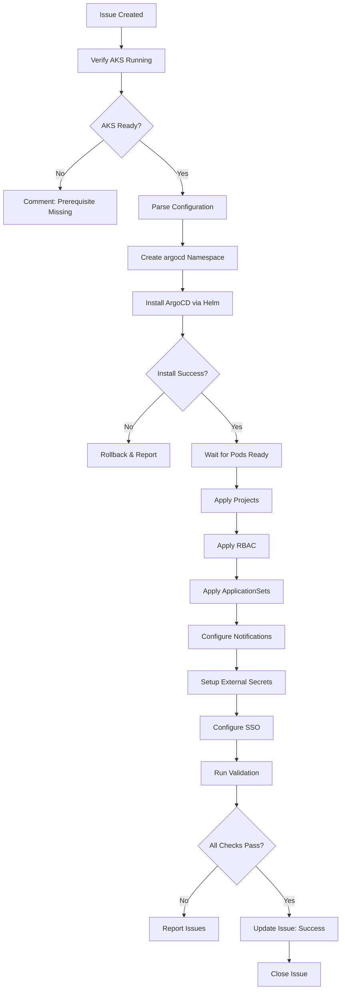

# GitOps Agent

## 🤖 Agent Identity

```yaml
name: gitops-agent
version: 1.0.0
horizon: H2 - Enhancement
description: |
  Configures ArgoCD GitOps platform on AKS clusters.
  Creates ApplicationSets, Projects, RBAC, notifications, and sync policies.
  Establishes GitOps workflows for application deployment.
  
author: Microsoft LATAM Platform Engineering
model_compatibility:
  - GitHub Copilot Agent Mode
  - GitHub Copilot Coding Agent
  - Claude with MCP
```

---

## 📁 Terraform Module
**Primary Module:** `terraform/modules/argocd/main.tf`

## 📋 Related Resources
| Resource Type | Path |
|--------------|------|
| Terraform Module | `terraform/modules/argocd/main.tf` |
| Issue Template | `.github/ISSUE_TEMPLATE/gitops.yml` |
| ArgoCD Root App | `argocd/app-of-apps/root-application.yaml` |
| ApplicationSets | `argocd/applicationsets.yaml` |
| Projects | `argocd/projects.yaml` |
| RBAC | `argocd/rbac.yaml` |
| Notifications | `argocd/notifications.yaml` |
| Sync Policies | `argocd/sync-policies.yaml` |
| Repo Credentials | `argocd/repo-credentials.yaml` |

---

## 🎯 Capabilities

| Capability | Description | Complexity |
|------------|-------------|------------|
| **Install ArgoCD** | Deploy ArgoCD via Helm on AKS | Medium |
| **Configure SSO** | Entra ID / GitHub OAuth integration | High |
| **Create Projects** | Environment-based project isolation | Low |
| **Setup ApplicationSets** | Dynamic app generation from Git | Medium |
| **Configure RBAC** | Role-based access control | Medium |
| **Setup Notifications** | Teams, Slack, Email, PagerDuty | Low |
| **Create Sync Policies** | Auto-sync, windows, retry policies | Low |
| **Configure Repo Credentials** | GitHub, GitLab, Helm repos | Low |
| **Enable Secrets Management** | External Secrets Operator | Medium |

---

## 🔧 MCP Servers Required

```json
{
  "mcpServers": {
    "kubernetes": {
      "command": "npx",
      "args": ["-y", "@anthropic/mcp-kubernetes"],
      "description": "kubectl operations",
      "required": true,
      "capabilities": [
        "kubectl apply",
        "kubectl get",
        "kubectl describe",
        "kubectl logs",
        "kubectl exec",
        "kubectl port-forward"
      ]
    },
    "helm": {
      "command": "npx",
      "args": ["-y", "@anthropic/mcp-helm"],
      "description": "Helm chart operations",
      "required": true,
      "capabilities": [
        "helm repo add",
        "helm install",
        "helm upgrade",
        "helm list",
        "helm get values"
      ]
    },
    "argocd": {
      "command": "npx",
      "args": ["-y", "@anthropic/mcp-argocd"],
      "description": "ArgoCD CLI operations",
      "required": true,
      "capabilities": [
        "argocd app list",
        "argocd app sync",
        "argocd proj create",
        "argocd account list"
      ]
    },
    "github": {
      "command": "npx",
      "args": ["-y", "@modelcontextprotocol/server-github"],
      "description": "GitHub operations",
      "required": true,
      "env": {
        "GITHUB_TOKEN": "${GITHUB_TOKEN}"
      }
    },
    "filesystem": {
      "command": "npx",
      "args": ["-y", "@modelcontextprotocol/server-filesystem"],
      "description": "File operations",
      "required": true
    }
  }
}
```

---

## 🏷️ Trigger Labels

```yaml
primary_label: "agent:gitops"

required_labels:
  - horizon:h2

prerequisites:
  - "AKS cluster must be running"
  - "kubectl access configured"
  - "Infrastructure Agent completed"

environment_labels:
  - env:dev
  - env:staging
  - env:prod
```

---

## 📋 Issue Template

```markdown
---
name: GitOps Setup Request
about: Request ArgoCD configuration via GitOps Agent
title: "[H2] Setup GitOps - {PROJECT_NAME}"
labels: agent:gitops, horizon:h2
assignees: ''
---

## 🎯 Request Type
- [ ] New ArgoCD Installation
- [ ] Modify Existing Configuration
- [ ] Add ApplicationSet
- [ ] Configure Notifications
- [ ] Setup SSO

## 📍 Prerequisites Verification
- [ ] AKS cluster is running (Issue #{infrastructure_issue})
- [ ] kubectl access configured
- [ ] GitHub org/repos exist

## 🏢 Context

| Field | Value |
|-------|-------|
| Project Name | |
| AKS Cluster Name | |
| Resource Group | |
| GitOps Repository | |
| GitHub Organization | |

## ⚙️ Configuration

```yaml
# ArgoCD Installation
argocd:
  version: "2.9.3"
  namespace: "argocd"
  ha_enabled: false  # true for production
  
# SSO Configuration
sso:
  enabled: true
  provider: "github"  # or "azure-ad"
  github_org: ""
  allowed_teams:
    - "platform-team"
    - "developers"
    
# Projects
projects:
  - name: "dev"
    description: "Development environment"
    source_repos:
      - "https://github.com/{org}/*"
    destinations:
      - namespace: "dev-*"
        server: "https://kubernetes.default.svc"
    auto_sync: true
    
  - name: "staging"
    description: "Staging environment"
    source_repos:
      - "https://github.com/{org}/*"
    destinations:
      - namespace: "staging-*"
        server: "https://kubernetes.default.svc"
    auto_sync: true
    require_approval: true
    
  - name: "prod"
    description: "Production environment"
    source_repos:
      - "https://github.com/{org}/*"
    destinations:
      - namespace: "prod-*"
        server: "https://kubernetes.default.svc"
    auto_sync: false
    sync_windows:
      - schedule: "0 2 * * 0"  # Sundays at 2am
        duration: "4h"
        
# ApplicationSets
applicationsets:
  - name: "monorepo"
    type: "git-directory"
    repo: "https://github.com/{org}/platform-gitops"
    path: "apps/*"
    
  - name: "multi-repo"
    type: "scm-provider"
    github_org: "{org}"
    topic: "deploy-argocd"
    
# Notifications
notifications:
  teams:
    enabled: true
    webhook_url: ""
  slack:
    enabled: false
    webhook_url: ""
  email:
    enabled: false
    smtp_server: ""
    
# RBAC Roles
rbac:
  - role: "platform-engineer"
    permissions: "admin"
    groups: ["platform-team"]
    
  - role: "developer"
    permissions: "dev-full, staging-sync, prod-view"
    groups: ["developers"]
    
  - role: "qa"
    permissions: "staging-full, dev-view, prod-view"
    groups: ["qa-team"]
```

## ✅ Acceptance Criteria

- [ ] ArgoCD installed and accessible
- [ ] SSO configured and working
- [ ] Projects created per environment
- [ ] ApplicationSets generating apps correctly
- [ ] Notifications firing on sync events
- [ ] RBAC restricting access appropriately
- [ ] External Secrets Operator configured
```

---

## 🔄 Execution Workflow



---

## 🛠️ Tools & Commands

### Phase 1: Installation

```bash
# Add Helm repo
helm repo add argo https://argoproj.github.io/argo-helm
helm repo update

# Create namespace
kubectl create namespace argocd

# Install ArgoCD
helm install argocd argo/argo-cd \
  --namespace argocd \
  --values argocd-values.yaml \
  --wait --timeout 10m

# Wait for pods
kubectl wait --for=condition=ready pod \
  -l app.kubernetes.io/name=argocd-server \
  -n argocd --timeout=300s

# Get initial admin password
kubectl -n argocd get secret argocd-initial-admin-secret \
  -o jsonpath="{.data.password}" | base64 -d
```

### Phase 2: Configure ArgoCD

```bash
# Login to ArgoCD
argocd login argocd-server.argocd.svc.cluster.local \
  --username admin \
  --password $ARGOCD_PASSWORD \
  --insecure

# Apply Projects
kubectl apply -f argocd/projects.yaml

# Apply ApplicationSets
kubectl apply -f argocd/applicationsets.yaml

# Apply RBAC
kubectl apply -f argocd/rbac.yaml

# Apply Notifications
kubectl apply -f argocd/notifications.yaml

# Apply Sync Policies
kubectl apply -f argocd/sync-policies.yaml
```

### Phase 3: Setup External Secrets

```bash
# Install External Secrets Operator
helm repo add external-secrets https://charts.external-secrets.io
helm install external-secrets external-secrets/external-secrets \
  --namespace external-secrets \
  --create-namespace

# Apply ClusterSecretStore for Azure Key Vault
kubectl apply -f argocd/secrets.yaml
```

### Phase 4: Validation

```bash
# Check ArgoCD health
argocd app list

# Verify projects
argocd proj list

# Test ApplicationSet
kubectl get applicationsets -n argocd
kubectl get applications -n argocd

# Test notifications (create test sync)
argocd app sync test-app --dry-run

# Verify RBAC
argocd account can-i sync applications 'dev/*' --as developer
```

---

## 📁 Generated Artifacts

### argocd-values.yaml
```yaml
# Generated by GitOps Agent
server:
  replicas: 2
  autoscaling:
    enabled: true
    minReplicas: 2
    maxReplicas: 5
    
  ingress:
    enabled: true
    ingressClassName: nginx
    hosts:
      - argocd.${DOMAIN}
    tls:
      - secretName: argocd-tls
        hosts:
          - argocd.${DOMAIN}

  config:
    url: https://argocd.${DOMAIN}
    application.instanceLabelKey: argocd.argoproj.io/instance
    
    # GitHub SSO
    dex.config: |
      connectors:
        - type: github
          id: github
          name: GitHub
          config:
            clientID: ${GITHUB_CLIENT_ID}
            clientSecret: ${GITHUB_CLIENT_SECRET}
            orgs:
              - name: ${GITHUB_ORG}

controller:
  replicas: 2

repoServer:
  replicas: 2
  
applicationSet:
  enabled: true
  replicas: 2

notifications:
  enabled: true
  secret:
    create: true
```

### projects.yaml (excerpt)
```yaml
# Generated by GitOps Agent
apiVersion: argoproj.io/v1alpha1
kind: AppProject
metadata:
  name: dev
  namespace: argocd
spec:
  description: Development environment
  sourceRepos:
    - 'https://github.com/${ORG}/*'
  destinations:
    - namespace: 'dev-*'
      server: https://kubernetes.default.svc
  clusterResourceWhitelist:
    - group: ''
      kind: Namespace
  namespaceResourceWhitelist:
    - group: '*'
      kind: '*'
  syncPolicy:
    automated:
      prune: true
      selfHeal: true
```

---

## ✅ Validation Criteria

```yaml
validation_checks:
  argocd_installation:
    - namespace_exists: "argocd"
    - pods_running: 
        - "argocd-server"
        - "argocd-repo-server"
        - "argocd-application-controller"
        - "argocd-applicationset-controller"
    - service_accessible: true
    
  projects:
    - dev_project: "exists"
    - staging_project: "exists"
    - prod_project: "exists"
    
  applicationsets:
    - monorepo_appset: "generating_apps"
    - multi_repo_appset: "generating_apps"
    
  rbac:
    - admin_role: "can_sync_all"
    - developer_role: "can_sync_dev"
    - developer_role: "cannot_delete_prod"
    
  notifications:
    - teams_webhook: "configured"
    - test_notification: "delivered"
    
  external_secrets:
    - operator_running: true
    - keyvault_connected: true
```

---

## 💬 Agent Communication

### On Start
```markdown
👋 **GitOps Agent Activated**

I'm setting up ArgoCD for **{project_name}**.

**Prerequisites Verified:**
- ✅ AKS Cluster: {cluster_name}
- ✅ kubectl access: Working
- ✅ GitHub access: {org}

**Status:** 🔄 Installing ArgoCD...
```

### On Success
```markdown
✅ **GitOps Platform Ready**

**ArgoCD Installed:**
- URL: https://argocd.{domain}
- Version: 2.9.3

**Projects Created:**
| Project | Auto-Sync | Status |
|---------|-----------|--------|
| dev | ✅ Enabled | Ready |
| staging | ⚠️ With Approval | Ready |
| prod | 🔒 Manual | Ready |

**ApplicationSets Active:**
- `monorepo-apps` - Watching `apps/*`
- `multi-repo-apps` - Watching GitHub topic

**Notifications:**
- Teams: ✅ Configured

**Next Steps:**
1. Access ArgoCD: `kubectl port-forward svc/argocd-server -n argocd 8080:443`
2. Login: admin / (run `kubectl -n argocd get secret argocd-initial-admin-secret -o jsonpath="{.data.password}" | base64 -d`)
3. Create issue with `agent:golden-paths` to register templates

🎉 Closing this issue.
```

---

## 🔗 Dependencies & Related Agents

| Agent | Relationship | Notes |
|-------|--------------|-------|
| `infrastructure-agent` | **Prerequisite** | AKS must exist |
| `golden-paths-agent` | **Next Step** | Register templates |
| `observability-agent` | **Parallel** | Can run simultaneously |
| `security-agent` | **Parallel** | For secrets setup |

---

**Spec Version:** 1.0.0  
**Last Updated:** December 2024
