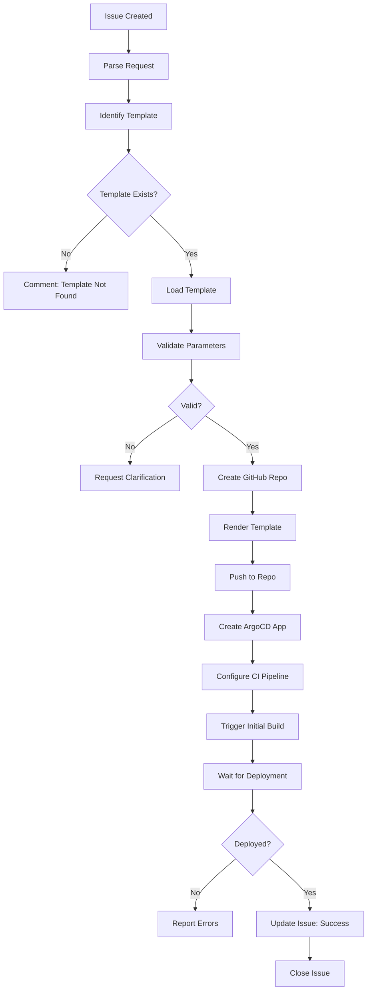

# Golden Paths Agent

## 🤖 Agent Identity

```yaml
name: golden-paths-agent
version: 1.0.0
horizon: H2 - Enhancement
description: |
  Manages Golden Path templates for self-service application scaffolding.
  Registers templates in RHDH/Backstage, creates new applications from templates,
  and maintains template catalog across horizons.
  
author: Microsoft LATAM Platform Engineering
model_compatibility:
  - GitHub Copilot Agent Mode
  - GitHub Copilot Coding Agent
  - Claude with MCP
```

---

## 📁 Golden Path Templates

### H1 Foundation (6 templates)
| Template | Path |
|----------|------|
| New Microservice | `golden-paths/h1-foundation/new-microservice/template.yaml` |
| Basic CI/CD | `golden-paths/h1-foundation/basic-cicd/template.yaml` |
| Security Baseline | `golden-paths/h1-foundation/security-baseline/template.yaml` |
| Documentation Site | `golden-paths/h1-foundation/documentation-site/template.yaml` |
| Infrastructure Provisioning | `golden-paths/h1-foundation/infrastructure-provisioning/template.yaml` |
| Web Application | `golden-paths/h1-foundation/web-application/template.yaml` |

### H2 Enhancement (8 templates)
| Template | Path |
|----------|------|
| API Microservice | `golden-paths/h2-enhancement/api-microservice/template.yaml` |
| GitOps Deployment | `golden-paths/h2-enhancement/gitops-deployment/template.yaml` |
| Event-Driven Microservice | `golden-paths/h2-enhancement/event-driven-microservice/template.yaml` |
| Data Pipeline | `golden-paths/h2-enhancement/data-pipeline/template.yaml` |
| Batch Job | `golden-paths/h2-enhancement/batch-job/template.yaml` |
| API Gateway | `golden-paths/h2-enhancement/api-gateway/template.yaml` |
| Microservice | `golden-paths/h2-enhancement/microservice/template.yaml` |
| Reusable Workflows | `golden-paths/h2-enhancement/reusable-workflows/template.yaml` |

### H3 Innovation (7 templates)
| Template | Path |
|----------|------|
| RAG Application | `golden-paths/h3-innovation/rag-application/template.yaml` |
| Foundry Agent | `golden-paths/h3-innovation/foundry-agent/template.yaml` |
| MLOps Pipeline | `golden-paths/h3-innovation/mlops-pipeline/template.yaml` |
| Multi-Agent System | `golden-paths/h3-innovation/multi-agent-system/template.yaml` |
| Copilot Extension | `golden-paths/h3-innovation/copilot-extension/template.yaml` |
| AI Evaluation Pipeline | `golden-paths/h3-innovation/ai-evaluation-pipeline/template.yaml` |
| SRE Agent Integration | `golden-paths/h3-innovation/sre-agent-integration/template.yaml` |

## 📋 Related Resources
| Resource Type | Path |
|--------------|------|
| Issue Template | `.github/ISSUE_TEMPLATE/golden-paths.yml` |
| RHDH Integration | `platform/rhdh/values.yaml` |

---

## 🎯 Capabilities

| Capability | Description | Complexity |
|------------|-------------|------------|
| **Register Template** | Add template to RHDH catalog | Low |
| **Scaffold Application** | Create new app from template | Medium |
| **Update Template** | Modify existing template | Medium |
| **Validate Template** | Test template syntax and rendering | Low |
| **List Templates** | Show available templates by horizon | Low |
| **Create Custom Template** | Build new template from requirements | High |
| **Migrate Template** | Convert from other formats | Medium |

---

## 🔧 MCP Servers Required

```json
{
  "mcpServers": {
    "github": {
      "command": "npx",
      "args": ["-y", "@modelcontextprotocol/server-github"],
      "description": "GitHub repo operations",
      "required": true,
      "env": {
        "GITHUB_TOKEN": "${GITHUB_TOKEN}"
      }
    },
    "filesystem": {
      "command": "npx",
      "args": ["-y", "@modelcontextprotocol/server-filesystem"],
      "description": "Template file operations",
      "required": true
    },
    "kubernetes": {
      "command": "npx",
      "args": ["-y", "@anthropic/mcp-kubernetes"],
      "description": "RHDH catalog operations",
      "required": true
    }
  }
}
```

---

## 🏷️ Trigger Labels

```yaml
primary_label: "agent:golden-paths"

required_labels:
  - horizon:h2

action_labels:
  - action:register      # Register existing template
  - action:scaffold      # Create app from template
  - action:create        # Create new template
  - action:update        # Update existing template
  - action:validate      # Validate template syntax

template_type_labels:
  - template:microservice
  - template:api
  - template:frontend
  - template:ai-app
  - template:data-pipeline
  - template:infrastructure
```

---

## 📋 Issue Template - Scaffold Application

```markdown
---
name: Scaffold New Application
about: Create new application from Golden Path template
title: "[H2] Scaffold App - {APP_NAME}"
labels: agent:golden-paths, horizon:h2, action:scaffold
assignees: ''
---

## 🎯 Request Type
- [x] Scaffold New Application

## 📦 Template Selection

| Template | Description |
|----------|-------------|
| [ ] `dotnet-microservice` | .NET 8 microservice with CQRS |
| [ ] `java-springboot-api` | Spring Boot 3 REST API |
| [ ] `nodejs-express-api` | Node.js Express API |
| [ ] `python-fastapi` | Python FastAPI service |
| [ ] `react-frontend` | React 18 with TypeScript |
| [ ] `ai-rag-app` | RAG application with Foundry |
| [ ] `ai-agent-service` | AI Agent with Semantic Kernel |

## 🏢 Application Details

| Field | Value |
|-------|-------|
| Application Name | |
| Description | |
| Team/Owner | |
| Target Environment | dev / staging / prod |
| GitHub Organization | |

## ⚙️ Configuration

```yaml
# Application Parameters
app:
  name: ""
  description: ""
  owner: "team-name"
  
# Repository
repo:
  visibility: "private"
  default_branch: "main"
  branch_protection: true
  
# Deployment
deploy:
  environment: "dev"
  namespace: "${app.name}-${deploy.environment}"
  replicas: 2
  
# Features
features:
  database: true
  database_type: "postgresql"  # postgresql, mongodb, redis
  messaging: false
  messaging_type: "servicebus"  # servicebus, eventhub
  cache: true
  observability: true
  
# Azure Resources
azure:
  create_resources: true
  resource_group: "${project}-${environment}-rg"
```

## ✅ Acceptance Criteria

- [ ] GitHub repository created
- [ ] Application code scaffolded
- [ ] CI/CD pipeline configured
- [ ] ArgoCD Application created
- [ ] Initial deployment successful
- [ ] README with setup instructions
```

---

## 📋 Issue Template - Register Template

```markdown
---
name: Register Golden Path Template
about: Register a new template in the catalog
title: "[H2] Register Template - {TEMPLATE_NAME}"
labels: agent:golden-paths, horizon:h2, action:register
assignees: ''
---

## 🎯 Request Type
- [x] Register New Template

## 📦 Template Information

| Field | Value |
|-------|-------|
| Template Name | |
| Template Type | microservice / api / frontend / ai-app / infra |
| Horizon | H1 / H2 / H3 |
| Source Repository | |
| Template Path | |

## 📝 Template Metadata

```yaml
apiVersion: scaffolder.backstage.io/v1beta3
kind: Template
metadata:
  name: ""
  title: ""
  description: ""
  tags:
    - recommended
    - dotnet
    - microservice
spec:
  owner: "platform-team"
  type: service
  
  parameters:
    # Define here...
    
  steps:
    # Define here...
    
  output:
    links:
      - title: Repository
        url: ${{ steps.publish.output.remoteUrl }}
```

## ✅ Acceptance Criteria

- [ ] Template registered in RHDH catalog
- [ ] Template visible in UI
- [ ] Template renders correctly
- [ ] Test scaffold successful
```

---

## 🔄 Execution Workflow - Scaffold



---

## 🛠️ Tools & Commands

### Scaffold Application

```bash
# 1. Create GitHub repository
gh repo create ${ORG}/${APP_NAME} \
  --private \
  --description "${DESCRIPTION}" \
  --clone

# 2. Download and render template
cd ${APP_NAME}

# Copy template files
cp -r /templates/${TEMPLATE_NAME}/* .

# Render placeholders
find . -type f -name "*.yaml" -o -name "*.json" -o -name "*.cs" -o -name "*.ts" | \
  xargs sed -i "s/{{APP_NAME}}/${APP_NAME}/g"
  
# 3. Initialize repository
git add .
git commit -m "feat: scaffold ${APP_NAME} from ${TEMPLATE_NAME}"
git push -u origin main

# 4. Create ArgoCD Application
kubectl apply -f - <<EOF
apiVersion: argoproj.io/v1alpha1
kind: Application
metadata:
  name: ${APP_NAME}
  namespace: argocd
spec:
  project: ${ENVIRONMENT}
  source:
    repoURL: https://github.com/${ORG}/${APP_NAME}
    targetRevision: HEAD
    path: deploy/kubernetes
  destination:
    server: https://kubernetes.default.svc
    namespace: ${APP_NAME}-${ENVIRONMENT}
  syncPolicy:
    automated:
      prune: true
      selfHeal: true
EOF

# 5. Create namespace
kubectl create namespace ${APP_NAME}-${ENVIRONMENT}

# 6. Trigger sync
argocd app sync ${APP_NAME}
```

### Register Template

```bash
# 1. Validate template syntax
npx @backstage/cli scaffold:preview \
  --template ${TEMPLATE_PATH}/template.yaml

# 2. Add to catalog locations
kubectl apply -f - <<EOF
apiVersion: backstage.io/v1alpha1
kind: Location
metadata:
  name: ${TEMPLATE_NAME}
  namespace: rhdh
spec:
  type: url
  target: https://github.com/${ORG}/platform-templates/blob/main/${TEMPLATE_PATH}/template.yaml
EOF

# 3. Refresh catalog
curl -X POST \
  "https://rhdh.${DOMAIN}/api/catalog/refresh" \
  -H "Authorization: Bearer ${RHDH_TOKEN}"

# 4. Verify registration
curl "https://rhdh.${DOMAIN}/api/catalog/entities/by-name/template/default/${TEMPLATE_NAME}"
```

---

## 📁 Template Catalog Structure

```
golden-paths/
├── h1-foundation/
│   ├── terraform-module/
│   │   └── template.yaml
│   ├── networking-config/
│   │   └── template.yaml
│   └── security-baseline/
│       └── template.yaml
│
├── h2-enhancement/
│   ├── dotnet-microservice/
│   │   ├── template.yaml
│   │   ├── skeleton/
│   │   └── docs/
│   ├── java-springboot-api/
│   ├── nodejs-express-api/
│   ├── python-fastapi/
│   ├── react-frontend/
│   ├── azure-function/
│   └── github-actions-pipeline/
│
└── h3-innovation/
    ├── ai-rag-app/
    │   ├── template.yaml
    │   ├── skeleton/
    │   └── docs/
    ├── ai-agent-service/
    ├── mlops-pipeline/
    ├── semantic-kernel-bot/
    ├── autogen-multi-agent/
    └── sre-agent-config/
```

---

## ✅ Validation Criteria

```yaml
validation_checks:
  scaffold:
    - repo_created: true
    - files_rendered: true
    - no_placeholder_remaining: true
    - ci_pipeline_exists: true
    - argocd_app_created: true
    - initial_deployment: "healthy"
    
  register:
    - template_syntax: "valid"
    - catalog_entry: "exists"
    - ui_visible: true
    - test_scaffold: "successful"
```

---

## 💬 Agent Communication

### On Scaffold Start
```markdown
👋 **Golden Paths Agent Activated**

I'm scaffolding **{app_name}** using template `{template_name}`.

**Configuration:**
- Owner: {team}
- Environment: {env}
- Features: Database (PostgreSQL), Cache, Observability

**Status:** 🔄 Creating repository...
```

### On Scaffold Success
```markdown
✅ **Application Scaffolded Successfully**

**Created Resources:**
| Resource | Details |
|----------|---------|
| Repository | [{org}/{app_name}](https://github.com/{org}/{app_name}) |
| Namespace | `{app_name}-{env}` |
| ArgoCD App | `{app_name}` |
| CI Pipeline | GitHub Actions |

**Deployment Status:** ✅ Healthy

**Quick Commands:**
```bash
# Clone repository
git clone https://github.com/{org}/{app_name}

# View in ArgoCD
argocd app get {app_name}

# Port forward
kubectl port-forward svc/{app_name} -n {app_name}-{env} 8080:80
```

**Next Steps:**
1. Review generated code
2. Customize configuration
3. Add business logic
4. Create PR for review

🎉 Closing this issue.
```

---

## 🔗 Related Agents

| Agent | Relationship | Notes |
|-------|--------------|-------|
| `gitops-agent` | **Prerequisite** | ArgoCD must be configured |
| `rhdh-portal-agent` | **Parallel** | For RHDH catalog |
| `observability-agent` | **Post** | For monitoring setup |
| `security-agent` | **Post** | For secrets injection |

---

**Spec Version:** 1.0.0  
**Last Updated:** December 2024
