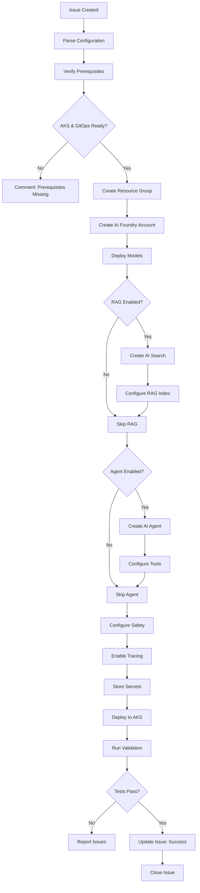

# AI Foundry Agent

## ⚠️ Explicit Consent Required

**CRITICAL**: This agent creates AI resources with significant cost implications. Always obtain explicit approval before proceeding.

**User Consent Prompt:**
```markdown
🤖 **Azure AI Foundry Deployment Request**

This action will:
- ✅ Create AI Foundry project (Cognitive Services account)
- ✅ Deploy AI models (GPT-4o, embeddings, etc.)
- ✅ Create AI Search service (if RAG enabled)
- ✅ Deploy AI Agent (if enabled)
- ✅ Enable Content Safety filters
- ⚠️ **Significant monthly costs apply**

**Estimated Monthly Costs:**
- AI Models: $100-$10,000+ (depends on TPM capacity)
  - GPT-4o: ~$3-$30/1M tokens
  - Text-embedding: ~$0.10/1M tokens
- AI Search: $250-$2,500 (Standard/S1-S3)
- Storage: $20-$100/month

**Configuration:**
- Models to Deploy: ${MODELS_LIST}
- RAG Enabled: ${RAG_ENABLED}
- AI Agent: ${AGENT_ENABLED}
- TPM Capacity: ${TPM_CAPACITY}K

Type **"approve:ai-foundry capacity={TPM}"** to proceed or **"reject"** to cancel.
```

**Approval Format:** `approve:ai-foundry models={list} capacity={TPM} rag={true|false}`

## 🤖 Agent Identity

```yaml
name: ai-foundry-agent
version: 1.0.0
horizon: H3 - Innovation
description: |
  Deploys and configures Azure AI Foundry - Microsoft's comprehensive enterprise AI platform.
  AI Foundry is a unified hub supporting multiple AI providers (Azure OpenAI, Anthropic Claude,
  Meta Llama, Mistral), agent development, RAG pipelines, and responsible AI controls.
  Creates AI projects, deploys models across providers, configures autonomous agents,
  and integrates enterprise AI capabilities into the platform.
  
author: Microsoft LATAM Platform Engineering
model_compatibility:
  - GitHub Copilot Agent Mode
  - GitHub Copilot Coding Agent
  - Claude with MCP
```

---

## 📁 Terraform Module
**Primary Module:** `terraform/modules/ai-foundry/main.tf`

## 📋 Related Resources
| Resource Type | Path |
|--------------|------|
| Terraform Module | `terraform/modules/ai-foundry/main.tf` |
| Issue Template | `.github/ISSUE_TEMPLATE/ai-foundry.yml` |
| Sizing Config | `config/sizing-profiles.yaml` |
| Region Matrix | `config/region-availability.yaml` |
| RAG Template | `golden-paths/h3-innovation/rag-application/template.yaml` |
| Foundry Agent Template | `golden-paths/h3-innovation/foundry-agent/template.yaml` |
| Defender for AI | `terraform/modules/defender/main.tf` |

---

## 🎯 Capabilities

| Capability | Description | Complexity |
|------------|-------------|------------|
| **Create AI Project** | Setup Azure AI Foundry project | Medium |
| **Deploy Model** | Deploy OpenAI/custom models | Medium |
| **Configure RAG** | Setup RAG with AI Search | High |
| **Create AI Agent** | Deploy Foundry Agent Service | High |
| **Setup Semantic Kernel** | Configure SK orchestration | Medium |
| **Enable Tracing** | Configure AI observability | Low |
| **Setup Guardrails** | Content safety & limits | Medium |
| **Configure Evaluation** | AI model evaluation pipeline | Medium |

---

## 🔧 MCP Servers Required

```json
{
  "mcpServers": {
    "azure": {
      "command": "npx",
      "args": ["-y", "@anthropic/mcp-azure"],
      "description": "Azure AI Foundry operations",
      "required": true,
      "capabilities": [
        "az cognitiveservices",
        "az ml",
        "az search",
        "az openai"
      ]
    },
    "azure-ai": {
      "command": "python",
      "args": ["-m", "azure_ai_mcp"],
      "description": "Azure AI SDK operations",
      "required": true,
      "capabilities": [
        "create_project",
        "deploy_model",
        "create_agent",
        "configure_rag"
      ]
    },
    "kubernetes": {
      "command": "npx",
      "args": ["-y", "@anthropic/mcp-kubernetes"],
      "description": "AI app deployment on AKS",
      "required": true
    },
    "github": {
      "command": "npx",
      "args": ["-y", "@modelcontextprotocol/server-github"],
      "description": "AI app repository management",
      "required": true,
      "env": {
        "GITHUB_TOKEN": "${GITHUB_TOKEN}"
      }
    },
    "filesystem": {
      "command": "npx",
      "args": ["-y", "@modelcontextprotocol/server-filesystem"],
      "description": "Configuration file management",
      "required": true
    }
  }
}
```

---

## 🏷️ Trigger Labels

```yaml
primary_label: "agent:ai-foundry"

required_labels:
  - horizon:h3

action_labels:
  - action:create-project    # Create AI Foundry project
  - action:deploy-model      # Deploy AI model
  - action:setup-rag         # Configure RAG pipeline
  - action:create-agent      # Create AI agent
  - action:configure-safety  # Setup content safety

model_labels:
  - model:gpt-4o
  - model:gpt-4o-mini
  - model:text-embedding-3-large
  - model:custom
```

---

## 📋 Issue Template - Setup AI Foundry

```markdown
---
name: Setup AI Foundry Project
about: Create and configure Azure AI Foundry for AI applications
title: "[H3] Setup AI Foundry - {PROJECT_NAME}"
labels: agent:ai-foundry, horizon:h3, action:create-project
assignees: ''
---

## 🎯 Request Type
- [ ] Create New AI Foundry Project
- [ ] Deploy AI Model
- [ ] Setup RAG Pipeline
- [ ] Create AI Agent
- [ ] Configure Safety Guardrails

## 📍 Prerequisites
- [ ] AKS cluster running (Issue #{infra_issue})
- [ ] GitOps configured (Issue #{gitops_issue})
- [ ] Key Vault accessible

## 🏢 Project Context

| Field | Value |
|-------|-------|
| Project Name | |
| Azure Subscription | |
| Resource Group | |
| Region | brazilsouth |
| Use Case | chatbot / rag / agent / copilot |

## ⚙️ Configuration

```yaml
# AI Foundry Project
ai_foundry:
  name: "${project}-ai-foundry"
  sku: "S0"
  
# Models to Deploy
models:
  - name: "gpt-4o"
    deployment_name: "gpt4o-main"
    version: "2024-08-06"
    capacity: 30  # TPM in thousands
    
  - name: "text-embedding-3-large"
    deployment_name: "embedding-main"
    version: "1"
    capacity: 120

# RAG Configuration (optional)
rag:
  enabled: true
  search_service: "${project}-search"
  search_sku: "standard"
  index_name: "knowledge-base"
  chunk_size: 512
  overlap: 128
  
# AI Agent Configuration (optional)
agent:
  enabled: true
  name: "${project}-agent"
  type: "conversational"  # conversational, task, autonomous
  tools:
    - name: "search_knowledge"
      type: "azure_search"
    - name: "execute_code"
      type: "code_interpreter"
    - name: "call_api"
      type: "function"
      
# Content Safety
safety:
  enabled: true
  hate_threshold: "medium"
  violence_threshold: "medium"
  self_harm_threshold: "high"
  sexual_threshold: "medium"
  
# Observability
observability:
  tracing_enabled: true
  app_insights: "${project}-ai-insights"
  log_prompts: false  # PII concern
  
# Integration
integration:
  deploy_to_aks: true
  namespace: "ai-apps"
  create_secrets: true
```

## ✅ Acceptance Criteria

- [ ] AI Foundry project created
- [ ] Models deployed and accessible
- [ ] RAG pipeline configured (if enabled)
- [ ] AI Agent created (if enabled)
- [ ] Content safety configured
- [ ] Tracing enabled
- [ ] Secrets stored in Key Vault
- [ ] Test query successful
```

---

## 📋 Issue Template - Create AI Agent

```markdown
---
name: Create AI Agent
about: Deploy an AI agent using Azure AI Foundry Agent Service
title: "[H3] Create AI Agent - {AGENT_NAME}"
labels: agent:ai-foundry, horizon:h3, action:create-agent
assignees: ''
---

## 🎯 Agent Type
- [ ] Conversational (chat-based)
- [ ] Task-oriented (specific function)
- [ ] Autonomous (self-directed)
- [ ] Multi-agent (orchestrated)

## 🤖 Agent Configuration

```yaml
agent:
  name: ""
  description: ""
  
  # Base Model
  model:
    deployment: "gpt4o-main"
    temperature: 0.7
    max_tokens: 4096
    
  # System Instructions
  instructions: |
    You are a helpful assistant for {company}.
    Your role is to help users with {specific_task}.
    
    Guidelines:
    - Be concise and professional
    - Always cite sources when using RAG
    - Escalate to human when uncertain
    
  # Tools
  tools:
    - name: "search_docs"
      type: "azure_search"
      config:
        index: "knowledge-base"
        top_k: 5
        
    - name: "get_user_info"
      type: "function"
      function:
        name: "get_user_profile"
        description: "Get user profile from CRM"
        parameters:
          type: object
          properties:
            user_id:
              type: string
              
    - name: "code_interpreter"
      type: "code_interpreter"
      enabled: true
      
  # Memory
  memory:
    type: "conversation"
    max_turns: 20
    
  # Guardrails
  guardrails:
    max_iterations: 10
    timeout_seconds: 60
    require_approval: ["delete", "update"]
```

## ✅ Acceptance Criteria

- [ ] Agent created in Foundry
- [ ] Tools configured and tested
- [ ] System prompt validated
- [ ] Test conversation successful
- [ ] Deployed to AKS (if requested)
```

---

## 🔄 Execution Workflow



---

## 🛠️ Tools & Commands

### Phase 1: Create AI Foundry

```bash
# Create resource group (if not exists)
az group create \
  --name ${PROJECT}-ai-rg \
  --location ${REGION}

# Create AI Foundry account (Cognitive Services)
az cognitiveservices account create \
  --name ${PROJECT}-ai-foundry \
  --resource-group ${PROJECT}-ai-rg \
  --kind "OpenAI" \
  --sku "S0" \
  --location ${REGION} \
  --yes

# Get endpoint and keys
ENDPOINT=$(az cognitiveservices account show \
  --name ${PROJECT}-ai-foundry \
  --resource-group ${PROJECT}-ai-rg \
  --query "properties.endpoint" -o tsv)

KEY=$(az cognitiveservices account keys list \
  --name ${PROJECT}-ai-foundry \
  --resource-group ${PROJECT}-ai-rg \
  --query "key1" -o tsv)
```

### Phase 2: Deploy Models

```bash
# Deploy GPT-4o
az cognitiveservices account deployment create \
  --name ${PROJECT}-ai-foundry \
  --resource-group ${PROJECT}-ai-rg \
  --deployment-name "gpt4o-main" \
  --model-name "gpt-4o" \
  --model-version "2024-08-06" \
  --model-format "OpenAI" \
  --sku-capacity 30 \
  --sku-name "Standard"

# Deploy Embedding model
az cognitiveservices account deployment create \
  --name ${PROJECT}-ai-foundry \
  --resource-group ${PROJECT}-ai-rg \
  --deployment-name "embedding-main" \
  --model-name "text-embedding-3-large" \
  --model-version "1" \
  --model-format "OpenAI" \
  --sku-capacity 120 \
  --sku-name "Standard"
```

### Phase 3: Setup RAG (if enabled)

```bash
# Create AI Search
az search service create \
  --name ${PROJECT}-search \
  --resource-group ${PROJECT}-ai-rg \
  --sku standard \
  --location ${REGION}

# Get search key
SEARCH_KEY=$(az search admin-key show \
  --service-name ${PROJECT}-search \
  --resource-group ${PROJECT}-ai-rg \
  --query "primaryKey" -o tsv)

# Create index via REST API
curl -X PUT \
  "https://${PROJECT}-search.search.windows.net/indexes/knowledge-base?api-version=2024-07-01" \
  -H "Content-Type: application/json" \
  -H "api-key: ${SEARCH_KEY}" \
  -d @index-schema.json
```

### Phase 4: Create AI Agent

```python
# Using Azure AI SDK
from azure.ai.projects import AIProjectClient
from azure.identity import DefaultAzureCredential

# Initialize client
client = AIProjectClient(
    credential=DefaultAzureCredential(),
    endpoint=f"https://{project}-ai-foundry.openai.azure.com"
)

# Create agent
agent = client.agents.create(
    name=f"{project}-agent",
    model="gpt4o-main",
    instructions="""
    You are a helpful assistant for {company}.
    Your role is to help users with {specific_task}.
    """,
    tools=[
        {"type": "azure_search", "azure_search": {...}},
        {"type": "code_interpreter"},
        {"type": "function", "function": {...}}
    ]
)

print(f"Agent created: {agent.id}")
```

### Phase 5: Store Secrets

```bash
# Store in Key Vault
az keyvault secret set \
  --vault-name ${PROJECT}-kv \
  --name "ai-foundry-endpoint" \
  --value "${ENDPOINT}"

az keyvault secret set \
  --vault-name ${PROJECT}-kv \
  --name "ai-foundry-key" \
  --value "${KEY}"

az keyvault secret set \
  --vault-name ${PROJECT}-kv \
  --name "ai-search-key" \
  --value "${SEARCH_KEY}"

# Create ExternalSecret for Kubernetes
kubectl apply -f - <<EOF
apiVersion: external-secrets.io/v1beta1
kind: ExternalSecret
metadata:
  name: ai-foundry-secrets
  namespace: ai-apps
spec:
  refreshInterval: 1h
  secretStoreRef:
    name: azure-keyvault
    kind: ClusterSecretStore
  target:
    name: ai-foundry-secrets
  data:
    - secretKey: AZURE_OPENAI_ENDPOINT
      remoteRef:
        key: ai-foundry-endpoint
    - secretKey: AZURE_OPENAI_KEY
      remoteRef:
        key: ai-foundry-key
EOF
```

### Phase 6: Deploy to AKS

```bash
# Deploy AI application
kubectl apply -f - <<EOF
apiVersion: apps/v1
kind: Deployment
metadata:
  name: ${PROJECT}-ai-app
  namespace: ai-apps
spec:
  replicas: 2
  selector:
    matchLabels:
      app: ${PROJECT}-ai-app
  template:
    metadata:
      labels:
        app: ${PROJECT}-ai-app
    spec:
      serviceAccountName: ai-workload-identity
      containers:
        - name: app
          image: ${ACR_NAME}.azurecr.io/${PROJECT}-ai-app:latest
          ports:
            - containerPort: 8080
          env:
            - name: AZURE_OPENAI_ENDPOINT
              valueFrom:
                secretKeyRef:
                  name: ai-foundry-secrets
                  key: AZURE_OPENAI_ENDPOINT
          resources:
            requests:
              memory: "256Mi"
              cpu: "250m"
            limits:
              memory: "512Mi"
              cpu: "500m"
---
apiVersion: v1
kind: Service
metadata:
  name: ${PROJECT}-ai-app
  namespace: ai-apps
spec:
  selector:
    app: ${PROJECT}-ai-app
  ports:
    - port: 80
      targetPort: 8080
EOF
```

---

## ✅ Validation Criteria

```yaml
validation_checks:
  ai_foundry:
    - account_status: "Succeeded"
    - models_deployed: ["gpt4o-main", "embedding-main"]
    
  models:
    - gpt4o_test: "completion_successful"
    - embedding_test: "vector_returned"
    
  rag:
    - search_service: "running"
    - index_created: true
    - test_query: "results_returned"
    
  agent:
    - agent_created: true
    - tools_configured: true
    - test_conversation: "successful"
    
  safety:
    - content_filter: "enabled"
    - thresholds_set: true
    
  deployment:
    - pods_running: ">= 2"
    - service_accessible: true
    - test_request: "200 OK"
```

---

## � GitHub Actions Workflow

**Workflow File:** `.github/workflows/ai-foundry-deploy.yml`

```yaml
name: Deploy Azure AI Foundry

on:
  issues:
    types: [labeled]
  workflow_dispatch:
    inputs:
      project_name:
        description: 'Project name'
        required: true
      models:
        description: 'Models to deploy (comma-separated)'
        required: true
        default: 'gpt-4o,text-embedding-3-large'
      rag_enabled:
        description: 'Enable RAG with AI Search'
        type: boolean
        default: false

permissions:
  id-token: write
  contents: read
  issues: write

jobs:
  deploy-ai-foundry:
    runs-on: ubuntu-latest
    if: |
      (github.event_name == 'issues' && contains(github.event.issue.labels.*.name, 'agent:ai-foundry') && contains(github.event.issue.labels.*.name, 'approved')) ||
      (github.event_name == 'workflow_dispatch')
    
    steps:
      - name: Checkout
        uses: actions/checkout@v4
      
      - name: Parse issue configuration
        if: github.event_name == 'issues'
        id: parse
        uses: stefanbuck/github-issue-parser@v3
        with:
          template-path: .github/ISSUE_TEMPLATE/ai-foundry.yml
      
      - name: Set environment variables
        run: |
          if [[ "${{ github.event_name }}" == "workflow_dispatch" ]]; then
            echo "PROJECT_NAME=${{ github.event.inputs.project_name }}" >> $GITHUB_ENV
            echo "MODELS=${{ github.event.inputs.models }}" >> $GITHUB_ENV
            echo "RAG_ENABLED=${{ github.event.inputs.rag_enabled }}" >> $GITHUB_ENV
          else
            echo "PROJECT_NAME=${{ fromJson(steps.parse.outputs.jsonString).project_name }}" >> $GITHUB_ENV
            echo "RESOURCE_GROUP=${{ fromJson(steps.parse.outputs.jsonString).resource_group }}" >> $GITHUB_ENV
            echo "REGION=${{ fromJson(steps.parse.outputs.jsonString).region }}" >> $GITHUB_ENV
            echo "RAG_ENABLED=${{ fromJson(steps.parse.outputs.jsonString).rag_enabled }}" >> $GITHUB_ENV
          fi
      
      - name: Azure Login (OIDC)
        uses: azure/login@v2
        with:
          client-id: ${{ secrets.AZURE_CLIENT_ID }}
          tenant-id: ${{ secrets.AZURE_TENANT_ID }}
          subscription-id: ${{ secrets.AZURE_SUBSCRIPTION_ID }}
      
      - name: Create AI Foundry Account
        run: |
          az cognitiveservices account create \
            --name ${PROJECT_NAME}-ai-foundry \
            --resource-group ${RESOURCE_GROUP} \
            --kind OpenAI \
            --sku S0 \
            --location ${REGION:-eastus2} \
            --yes
          
          echo "AI_ENDPOINT=$(az cognitiveservices account show \
            --name ${PROJECT_NAME}-ai-foundry \
            --resource-group ${RESOURCE_GROUP} \
            --query properties.endpoint -o tsv)" >> $GITHUB_ENV
      
      - name: Deploy GPT-4o Model
        run: |
          az cognitiveservices account deployment create \
            --name ${PROJECT_NAME}-ai-foundry \
            --resource-group ${RESOURCE_GROUP} \
            --deployment-name gpt4o-main \
            --model-name gpt-4o \
            --model-version "2024-08-06" \
            --model-format OpenAI \
            --sku-capacity 30 \
            --sku-name Standard
      
      - name: Deploy Embedding Model
        run: |
          az cognitiveservices account deployment create \
            --name ${PROJECT_NAME}-ai-foundry \
            --resource-group ${RESOURCE_GROUP} \
            --deployment-name embedding-main \
            --model-name text-embedding-3-large \
            --model-version "1" \
            --model-format OpenAI \
            --sku-capacity 120 \
            --sku-name Standard
      
      - name: Create AI Search (if RAG enabled)
        if: env.RAG_ENABLED == 'true'
        run: |
          az search service create \
            --name ${PROJECT_NAME}-search \
            --resource-group ${RESOURCE_GROUP} \
            --sku standard \
            --location ${REGION:-eastus2}
          
          echo "SEARCH_ENDPOINT=https://${PROJECT_NAME}-search.search.windows.net" >> $GITHUB_ENV
      
      - name: Store secrets in Key Vault
        run: |
          AI_KEY=$(az cognitiveservices account keys list \
            --name ${PROJECT_NAME}-ai-foundry \
            --resource-group ${RESOURCE_GROUP} \
            --query key1 -o tsv)
          
          az keyvault secret set \
            --vault-name ${PROJECT_NAME}-kv \
            --name ai-foundry-endpoint \
            --value "${AI_ENDPOINT}"
          
          az keyvault secret set \
            --vault-name ${PROJECT_NAME}-kv \
            --name ai-foundry-key \
            --value "${AI_KEY}"
      
      - name: Run validation tests
        run: |
          chmod +x scripts/validate-config.sh
          ./scripts/validate-config.sh ai-foundry
      
      - name: Comment success on issue
        if: github.event_name == 'issues' && success()
        uses: actions/github-script@v7
        with:
          script: |
            const ragStatus = process.env.RAG_ENABLED === 'true' ? '✅ Enabled' : '⏭️ Skipped';
            github.rest.issues.createComment({
              issue_number: context.issue.number,
              owner: context.repo.owner,
              repo: context.repo.repo,
              body: `✅ **Azure AI Foundry Deployed Successfully**\n\n**Resources:**\n- AI Foundry: ${process.env.AI_ENDPOINT}\n- GPT-4o Model: ✅ Deployed (30K TPM)\n- Embedding Model: ✅ Deployed (120K TPM)\n- AI Search: ${ragStatus}\n\n**Next Steps:**\n1. Test model: \`curl ${process.env.AI_ENDPOINT}/openai/deployments/gpt4o-main/chat/completions\`\n2. Check Azure Portal for usage\n3. Configure AI agent using \`golden-paths/h3-innovation/foundry-agent/\``
            })
      
      - name: Close issue
        if: github.event_name == 'issues' && success()
        uses: actions/github-script@v7
        with:
          script: |
            github.rest.issues.update({
              issue_number: context.issue.number,
              owner: context.repo.owner,
              repo: context.repo.repo,
              state: 'closed',
              labels: ['completed']
            })
```

**Trigger:** Label issue with `agent:ai-foundry` + `approved`

---

## �💬 Agent Communication

### On Start
```markdown
👋 **AI Foundry Agent Activated**

I'm setting up Azure AI Foundry for **{project_name}**.

**Configuration:**
- Models: GPT-4o, text-embedding-3-large
- RAG: ✅ Enabled with AI Search
- Agent: ✅ Conversational type
- Safety: ✅ Content filtering enabled

**Status:** 🔄 Creating AI Foundry account...
```

### On Success
```markdown
✅ **AI Foundry Setup Complete**

**Resources Created:**
| Resource | Name | Status |
|----------|------|--------|
| AI Foundry | {project}-ai-foundry | ✅ Active |
| GPT-4o Model | gpt4o-main | ✅ Deployed |
| Embedding Model | embedding-main | ✅ Deployed |
| AI Search | {project}-search | ✅ Running |
| AI Agent | {project}-agent | ✅ Ready |

**Endpoints:**
- AI Foundry: `https://{project}-ai-foundry.openai.azure.com`
- AI Search: `https://{project}-search.search.windows.net`

**Test Results:**
- ✅ GPT-4o completion: Working
- ✅ Embedding generation: Working
- ✅ RAG query: 5 results returned
- ✅ Agent conversation: Successful

**Secrets stored in Key Vault:** {project}-kv

**Quick Test:**
```bash
curl -X POST https://{project}-ai-foundry.openai.azure.com/openai/deployments/gpt4o-main/chat/completions?api-version=2024-08-01-preview \
  -H "api-key: ${AZURE_OPENAI_KEY}" \
  -H "Content-Type: application/json" \
  -d '{"messages": [{"role": "user", "content": "Hello!"}]}'
```

🎉 Closing this issue.
```

---

## 🔗 Related Agents

| Agent | Relationship | Notes |
|-------|--------------|-------|
| `infrastructure-agent` | **Prerequisite** | AKS and networking |
| `security-agent` | **Prerequisite** | Key Vault setup |
| `golden-paths-agent` | **Post** | AI app templates |
| `observability-agent` | **Parallel** | AI monitoring |
| `sre-agent-setup` | **Post** | Autonomous operations |

---

**Spec Version:** 1.0.0  
**Last Updated:** December 2024
