# Three Horizons Accelerator - Architecture Guide

> **Version:** 4.0.0
> **Last Updated:** December 2025
> **Audience:** Architects, Tech Leads, Senior Engineers

---

## Table of Contents

1. [Introduction](#1-introduction)
2. [Understanding the Three Horizons Model](#2-understanding-the-three-horizons-model)
3. [High-Level Platform Architecture](#3-high-level-platform-architecture)
4. [Infrastructure Architecture](#4-infrastructure-architecture)
5. [Network Architecture](#5-network-architecture)
6. [Security Architecture](#6-security-architecture)
7. [GitOps Architecture](#7-gitops-architecture)
8. [Observability Architecture](#8-observability-architecture)
9. [AI/ML Architecture](#9-aiml-architecture)
10. [Agent Architecture](#10-agent-architecture)
11. [Data Flow Diagrams](#11-data-flow-diagrams)
12. [Architecture Decision Records](#12-architecture-decision-records)

---

## 1. Introduction

### What is This Guide?

This Architecture Guide explains **how** the Three Horizons Accelerator is designed and **why** specific technology choices were made. It's intended for architects and engineers who need to understand the platform's internal workings.

> 💡 **Different from the Deployment Guide**
>
> - **Deployment Guide:** Step-by-step instructions to deploy the platform
> - **Architecture Guide (this):** Explains the design decisions and component interactions

### Who Should Read This?

| Role | What You'll Learn |
|------|-------------------|
| **Cloud Architects** | Overall platform design and Azure service integration |
| **Security Architects** | Zero-trust implementation and security controls |
| **Platform Engineers** | Component interactions and customization points |
| **DevOps Engineers** | GitOps workflow and CI/CD architecture |
| **Tech Leads** | Technology choices and trade-offs |

### Key Concepts You'll Understand

After reading this guide, you'll understand:

1. Why we use the "Three Horizons" organizational model
2. How Azure services are integrated together
3. How network isolation and security work
4. How GitOps enables declarative infrastructure
5. How observability components interact
6. How AI capabilities are integrated

---

## 2. Understanding the Three Horizons Model

### 2.1 What is the Three Horizons Framework?

> 💡 **Origin of the Model**
>
> The Three Horizons Accelerator is a solution created in partnership with **Microsoft**,
> **GitHub**, and **Red Hat**. It helps organizations balance maintaining current operations
> (H1) while developing improvements (H2) and exploring future opportunities (H3).

The Three Horizons model organizes the platform into three layers with different purposes:

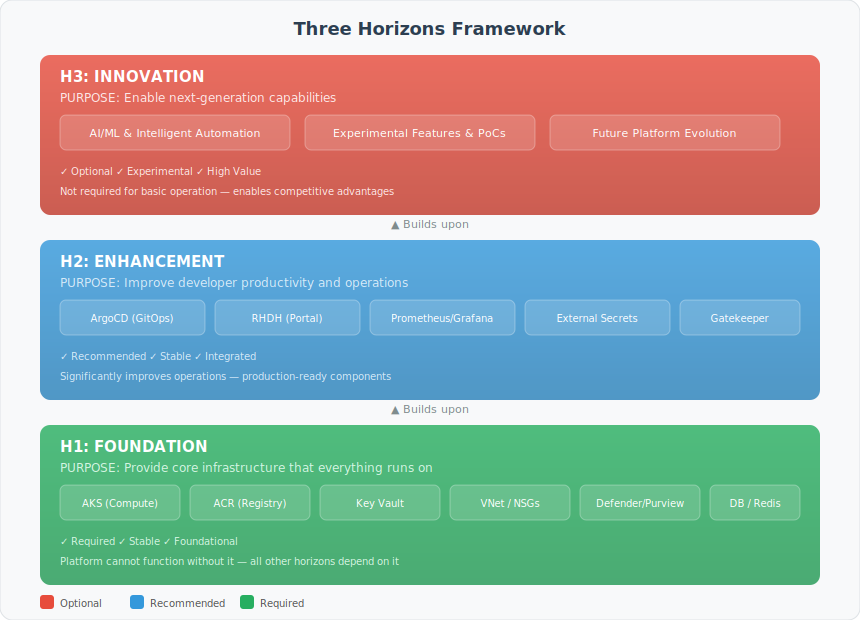

### 2.2 Why Use Three Horizons?

| Benefit | Explanation |
|---------|-------------|
| **Clear Dependencies** | Each horizon has well-defined dependencies on lower horizons |
| **Independent Scaling** | Horizons can evolve at different speeds |
| **Risk Isolation** | Experimental H3 features don't affect stable H1 infrastructure |
| **Incremental Adoption** | Organizations can start with H1, add H2/H3 when ready |
| **Budget Control** | Each horizon can have separate cost allocation |

### 2.3 Component Mapping by Horizon

#### H1: Foundation Components

| Component | Azure Service | Purpose | Required? |
|-----------|---------------|---------|-----------|
| **AKS** | Azure Kubernetes Service | Container orchestration | Yes |
| **ACR** | Azure Container Registry | Container image storage | Yes |
| **Key Vault** | Azure Key Vault | Secrets and certificates | Yes |
| **VNet** | Azure Virtual Network | Network isolation | Yes |
| **NSG** | Network Security Groups | Firewall rules | Yes |
| **Managed Identity** | Azure AD Managed Identity | Passwordless auth | Yes |
| **Defender** | Defender for Cloud | Threat protection | Recommended |
| **Purview** | Microsoft Purview | Data governance | Optional |
| **PostgreSQL** | Azure Database for PostgreSQL | Relational database | Optional |
| **Redis** | Azure Cache for Redis | Caching | Optional |

#### H2: Enhancement Components

| Component | Technology | Purpose | Required? |
|-----------|------------|---------|-----------|
| **ArgoCD** | CNCF ArgoCD | GitOps deployment | Recommended |
| **External Secrets** | External Secrets Operator | Secret synchronization | Recommended |
| **Prometheus** | CNCF Prometheus | Metrics collection | Recommended |
| **Grafana** | Grafana | Dashboards | Recommended |
| **Alertmanager** | CNCF Alertmanager | Alert routing | Recommended |
| **Gatekeeper** | OPA Gatekeeper | Policy enforcement | Recommended |
| **RHDH** | Red Hat Developer Hub | Developer portal | Optional |
| **GitHub Runners** | Self-hosted runners | CI/CD execution | Optional |

#### H3: Innovation Components

| Component | Technology | Purpose | Required? |
|-----------|------------|---------|-----------|
| **AI Foundry** | Azure OpenAI | LLM capabilities | Optional |
| **GPT-4o** | OpenAI GPT-4o | Text generation | Optional |
| **Embeddings** | text-embedding-3 | Vector embeddings | Optional |
| **Agents** | Custom implementations | Intelligent automation | Optional |

---

## 3. High-Level Platform Architecture

### 3.1 Layered Architecture Diagram


### 3.2 Design Principles

> 💡 **What are Design Principles?**
>
> Design principles are the rules we follow when making architecture decisions.
> They ensure consistency and help avoid common mistakes.

| Principle | What It Means | How We Implement It |
|-----------|---------------|---------------------|
| **Infrastructure as Code** | All infrastructure is defined in code, not created manually | Terraform for Azure resources, Kubernetes manifests for apps |
| **GitOps** | Git is the single source of truth for deployments | ArgoCD watches Git repos and syncs changes automatically |
| **Zero Trust** | Never trust, always verify | Private endpoints, workload identity, network policies |
| **Immutable Infrastructure** | Don't modify running systems; replace them | Rolling updates, blue-green deployments |
| **Observable** | Everything can be measured and monitored | Prometheus metrics, Grafana dashboards, alerts |
| **Self-Service** | Developers can deploy without ops intervention | Golden Path templates, RHDH portal |
| **Policy as Code** | Security policies are defined in code | Gatekeeper/OPA constraints |
| **Cost Awareness** | Monitor and optimize costs continuously | Azure Cost Management, budgets, alerts |

---

## 4. Infrastructure Architecture

### 4.1 AKS Cluster Architecture

> 💡 **What is AKS?**
>
> Azure Kubernetes Service (AKS) is a managed Kubernetes service. Azure manages
> the control plane (API server, etcd, scheduler), and you only manage the
> worker nodes where your applications run.

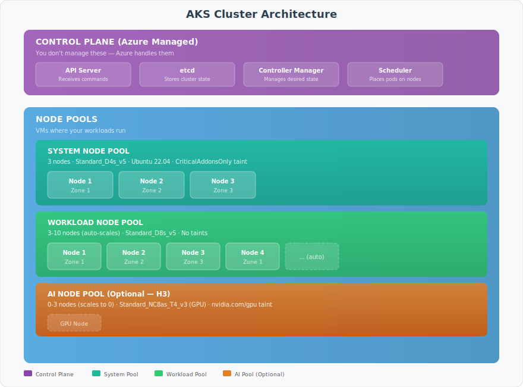

### 4.2 Why Multiple Node Pools?

| Node Pool | Purpose | Why Separate? |
|-----------|---------|---------------|
| **System** | Kubernetes system components | Isolates system pods from application disruptions |
| **Workload** | Application pods | Can scale independently based on app demand |
| **AI** | GPU-accelerated workloads | Expensive GPUs only used when needed (scales to 0) |

### 4.3 Cluster Add-ons

These are additional capabilities we enable on the AKS cluster:

| Add-on | What It Does | Why We Enable It |
|--------|--------------|------------------|
| **Azure CNI** | Network plugin | Assigns Azure VNet IPs to pods for better network integration |
| **Azure Policy** | Policy enforcement | Integrates with Azure Policy for compliance |
| **Workload Identity** | Pod authentication | Allows pods to authenticate to Azure without secrets |
| **Key Vault CSI** | Secret injection | Mounts Key Vault secrets as files in pods |
| **Blob CSI** | Blob storage | Allows pods to use Azure Blob storage as volumes |

---

## 5. Network Architecture

### 5.1 Network Topology

> 💡 **Why Network Architecture Matters**
>
> Proper network design is critical for:
> - **Security:** Isolating sensitive workloads
> - **Performance:** Reducing latency between components
> - **Compliance:** Meeting regulatory requirements for data isolation

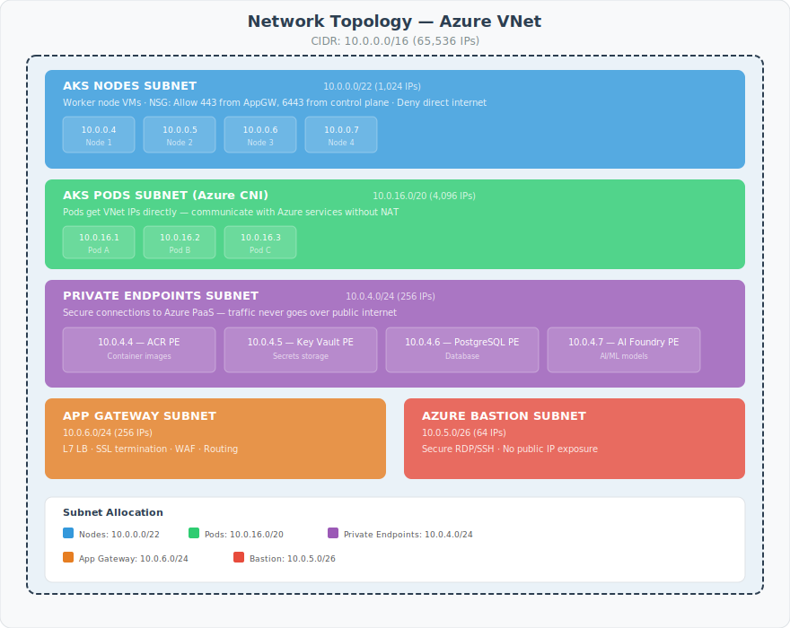

### 5.2 Private DNS Zones

> 💡 **What are Private DNS Zones?**
>
> When you create a private endpoint for an Azure service (like Key Vault),
> it gets a private IP (e.g., 10.0.4.5). Private DNS zones automatically
> resolve the service's public DNS name to this private IP when queried
> from within the VNet.

| Service | Private DNS Zone | Example Resolution |
|---------|------------------|-------------------|
| Key Vault | `privatelink.vaultcore.azure.net` | kv-myapp.vault.azure.net → 10.0.4.5 |
| ACR | `privatelink.azurecr.io` | myacr.azurecr.io → 10.0.4.4 |
| PostgreSQL | `privatelink.postgres.database.azure.com` | mydb.postgres.database.azure.com → 10.0.4.6 |
| OpenAI | `privatelink.openai.azure.com` | myoai.openai.azure.com → 10.0.4.7 |

### 5.3 Network Security Groups (NSGs)

NSGs act as firewalls at the subnet level:

```
┌────────────────────────────────────────────────────────────────────────────┐
│                        NSG: nsg-aks-nodes                                   │
├────────────────────────────────────────────────────────────────────────────┤
│  INBOUND RULES (what traffic is allowed IN):                               │
│                                                                             │
│  Priority │ Name              │ Source          │ Port  │ Action          │
│  ─────────┼───────────────────┼─────────────────┼───────┼─────────────────│
│  100      │ AllowAppGateway   │ AppGw Subnet    │ 443   │ Allow           │
│  110      │ AllowKubeAPI      │ AzureCloud      │ 443   │ Allow           │
│  120      │ AllowLoadBalancer │ AzureLoadBal    │ *     │ Allow           │
│  4096     │ DenyAllInbound    │ *               │ *     │ Deny            │
│                                                                             │
│  OUTBOUND RULES (what traffic is allowed OUT):                             │
│                                                                             │
│  Priority │ Name              │ Destination     │ Port  │ Action          │
│  ─────────┼───────────────────┼─────────────────┼───────┼─────────────────│
│  100      │ AllowAzureServices│ AzureCloud      │ 443   │ Allow           │
│  110      │ AllowPrivateEndpt │ VirtualNetwork  │ *     │ Allow           │
│  4096     │ DenyAllOutbound   │ Internet        │ *     │ Deny            │
└────────────────────────────────────────────────────────────────────────────┘
```

---

## 6. Security Architecture

### 6.1 Zero Trust Model

> 💡 **What is Zero Trust?**
>
> Zero Trust is a security model where you never trust anything by default,
> even if it's inside your network. Every request must be verified.

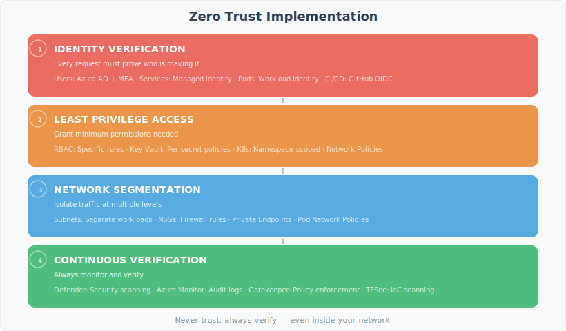

### 6.2 Workload Identity

> 💡 **What is Workload Identity?**
>
> Workload Identity allows Kubernetes pods to authenticate to Azure services
> using Azure AD tokens, without needing secrets or passwords.

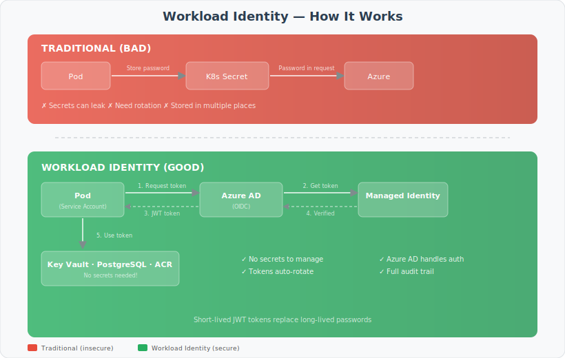

### 6.3 Secret Management Flow

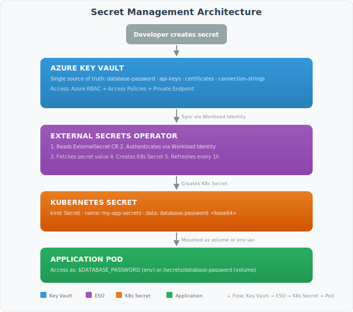

---

## 7. GitOps Architecture

### 7.1 What is GitOps?

> 💡 **GitOps Explained Simply**
>
> GitOps means **Git is the source of truth** for your infrastructure.
> Instead of running commands to deploy, you commit changes to Git,
> and a tool (ArgoCD) automatically applies them to your cluster.

### 7.2 GitOps Workflow

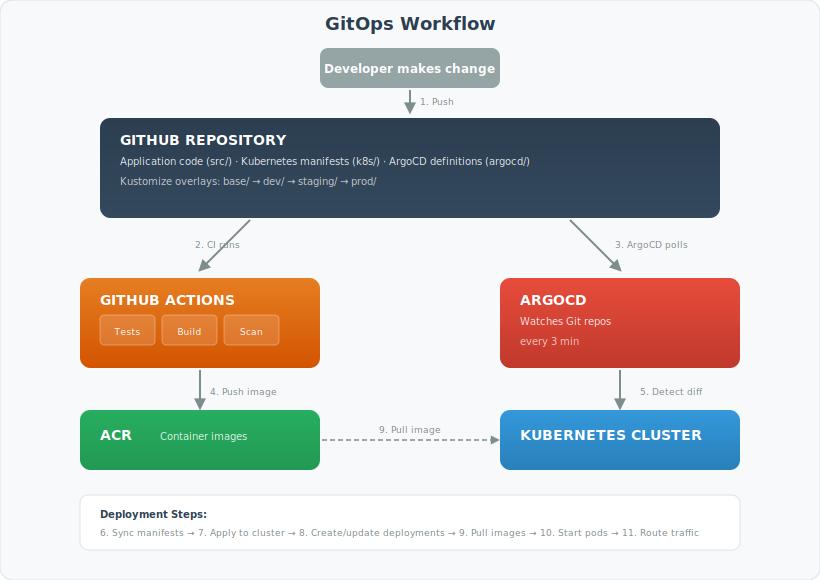

### 7.3 ArgoCD Application Model

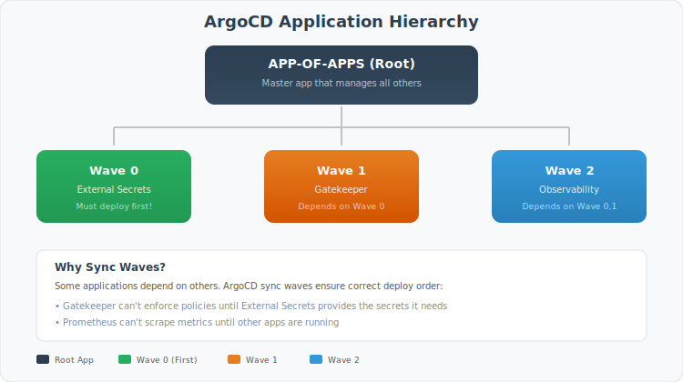

### 7.4 Sync Strategies

| Strategy | When to Use | How It Works |
|----------|-------------|--------------|
| **Auto-Sync** | Development environments | ArgoCD automatically applies changes when Git changes |
| **Manual Sync** | Production | Human must click "Sync" to apply changes |
| **Self-Heal** | Always-on environments | ArgoCD reverts manual changes made directly to cluster |
| **Prune** | Cleanup needed | Deletes resources removed from Git |

---

## 8. Observability Architecture

### 8.1 Observability Stack

> 💡 **What is Observability?**
>
> Observability is the ability to understand what's happening inside your system
> by looking at its external outputs: **metrics**, **logs**, and **traces**.

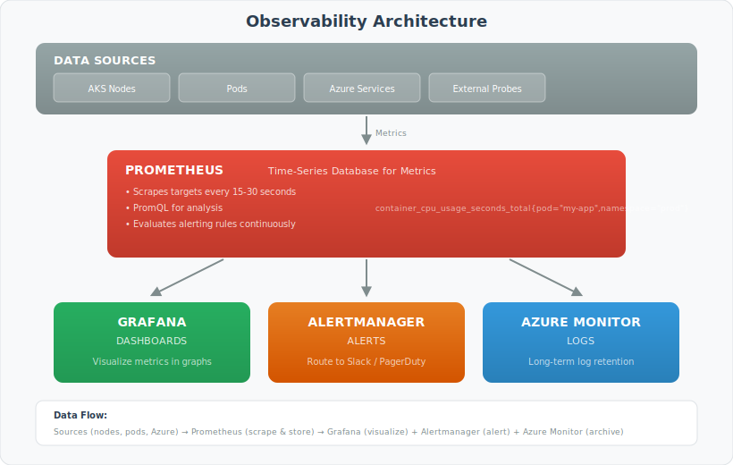

### 8.2 Metrics Collection

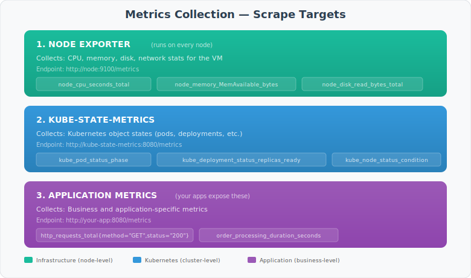

### 8.3 Alert Flow

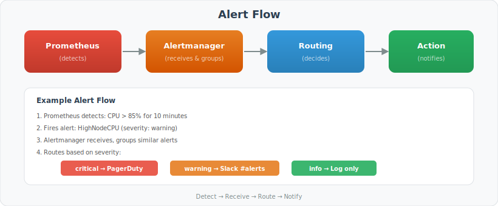

---

## 9. AI/ML Architecture

### 9.1 AI Foundry Integration

> 💡 **What is Azure AI Foundry?**
>
> Azure AI Foundry is a comprehensive enterprise AI platform that goes far beyond just Azure OpenAI.
> It provides a unified hub for building, deploying, and managing AI solutions at scale, including:
>
> - **Multiple AI Model Providers:** Azure OpenAI (GPT-4, GPT-4o), Anthropic Claude, Meta Llama, Mistral, and more
> - **AI Agent Development:** Tools for building autonomous agents for enterprise workflows
> - **RAG & Knowledge Management:** Vector search, document intelligence, and knowledge bases
> - **Responsible AI:** Built-in content safety, prompt shields, and governance controls
> - **MLOps Integration:** Model versioning, deployment pipelines, and monitoring
> - **Enterprise Security:** Private endpoints, managed identities, and compliance certifications

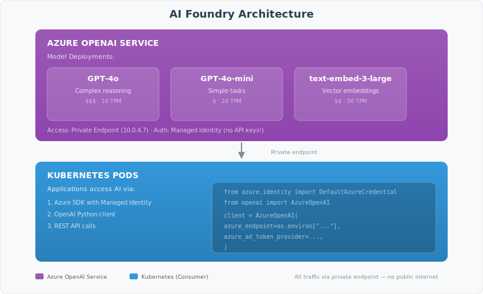

### 9.2 Model Selection Guide

| Model | Best For | Cost | Speed | Example Use Cases |
|-------|----------|------|-------|-------------------|
| **GPT-4o** | Complex reasoning, analysis | $$$ | Medium | Code review, complex Q&A, analysis |
| **GPT-4o-mini** | Simple tasks, high volume | $ | Fast | Chatbots, classification, summarization |
| **text-embedding-3-large** | Semantic search | $$ | Fast | RAG, similarity search, recommendations |

---

## 10. Agent Architecture

### 10.1 Agent Categories

The platform includes 23 pre-defined agents organized by horizon:

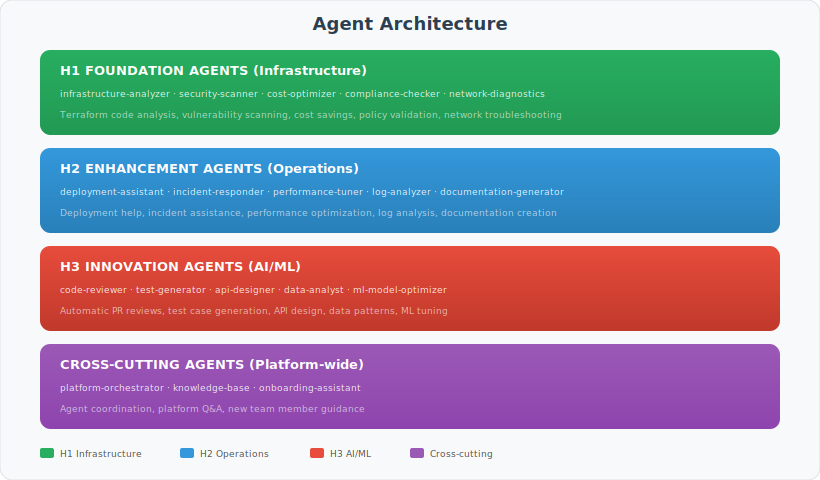

---

## 11. Data Flow Diagrams

### 11.1 Application Deployment Flow

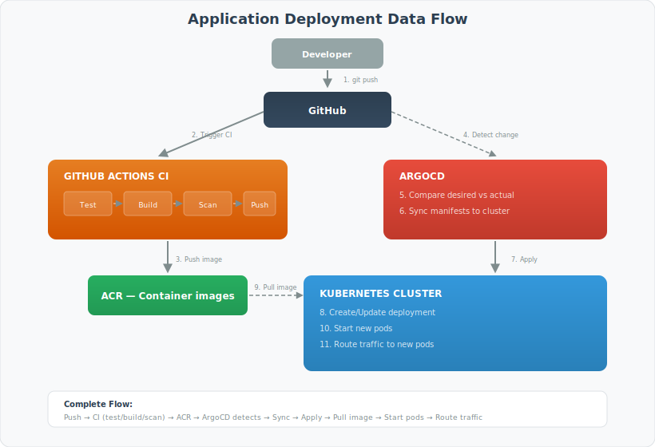

### 11.2 Secret Access Flow

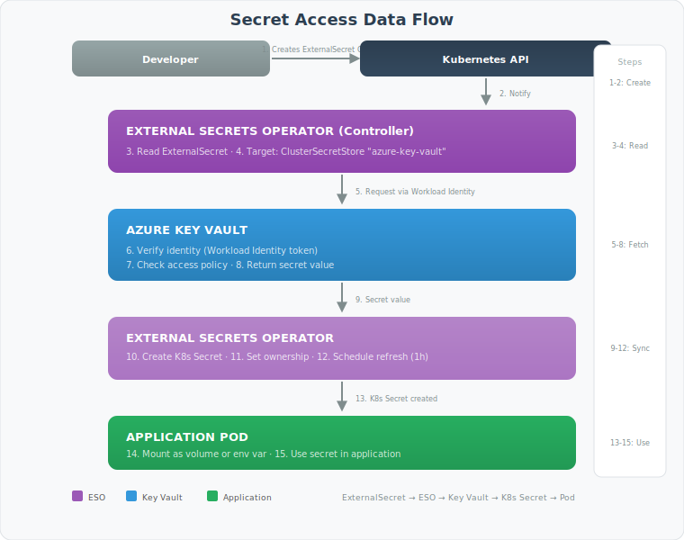

---

## 12. Architecture Decision Records

### ADR-001: Use AKS Instead of Self-Managed Kubernetes

**Status:** Accepted

**Context:** We need a Kubernetes platform for container orchestration.

**Decision:** Use Azure Kubernetes Service (AKS) instead of self-managed Kubernetes.

**Rationale:**
- Azure manages the control plane (99.95% SLA)
- Automatic security patches
- Deep Azure integration (identity, networking, storage)
- Lower operational overhead
- Cost: Only pay for worker nodes

**Trade-offs:**
- Less control over control plane configuration
- Tied to Azure's upgrade schedule

---

### ADR-002: Use ArgoCD for GitOps

**Status:** Accepted

**Context:** We need a mechanism to deploy applications declaratively.

**Decision:** Use ArgoCD for GitOps-based deployments.

**Rationale:**
- CNCF graduated project (mature, well-maintained)
- Excellent UI for visibility
- Supports Helm, Kustomize, plain YAML
- Application-centric model fits our needs
- Strong community support

**Alternatives Considered:**
- Flux: Good but less intuitive UI
- Jenkins X: More complex, heavier
- Spinnaker: Enterprise-focused, complex

---

### ADR-003: Use Azure CNI Networking

**Status:** Accepted

**Context:** Need to choose Kubernetes network plugin.

**Decision:** Use Azure CNI instead of kubenet.

**Rationale:**
- Pods get VNet IP addresses directly
- Better integration with Azure services
- Required for some features (Windows nodes, network policies)
- Better performance for large clusters

**Trade-offs:**
- Requires more IP addresses (need larger subnets)
- More complex IP planning

---

### ADR-004: Use External Secrets Operator

**Status:** Accepted

**Context:** Applications need access to secrets stored in Key Vault.

**Decision:** Use External Secrets Operator instead of Key Vault CSI driver.

**Rationale:**
- Works with standard Kubernetes Secrets (no application changes)
- Supports multiple secret stores (flexibility)
- Automatic refresh of secrets
- Better GitOps compatibility

**Trade-offs:**
- Additional component to maintain
- Secrets exist in-cluster (encrypted at rest)

---

## Summary

This Architecture Guide covered:

1. **Three Horizons Model:** How the platform is organized into Foundation, Enhancement, and Innovation layers
2. **Platform Architecture:** High-level view of all components
3. **Infrastructure:** AKS cluster design and node pools
4. **Networking:** VNet topology, subnets, and private endpoints
5. **Security:** Zero trust implementation and secret management
6. **GitOps:** ArgoCD workflow and application model
7. **Observability:** Prometheus, Grafana, and alerting
8. **AI/ML:** Azure AI Foundry - enterprise AI hub with multiple model providers and agent capabilities
9. **Agents:** 10 Copilot Chat Agents for development assistance
10. **Data Flows:** How deployments and secret access work
11. **ADRs:** Key architecture decisions and rationale

For implementation details, see the [Deployment Guide](./DEPLOYMENT_GUIDE.md).

---

## 🤖 Using Copilot Agents for Architecture

| Task | Agent | Example Prompt |
|------|-------|---------------|
| System design | `@architect` | "Design a microservice architecture for order processing" |
| WAF review | `@architect` | "Evaluate this design against the Reliability WAF pillar" |
| Module structure | `@terraform` | "Help me decompose this into reusable Terraform modules" |
| Security review | `@security` | "Review this architecture for Zero Trust compliance" |
| ADR creation | `@docs` | "Create an ADR for choosing Cosmos DB over PostgreSQL" |

> **Tip:** `@architect` will create Mermaid diagrams, evaluate trade-offs, and write ADRs. It automatically hands off to `@terraform` for implementation and `@security` for review.

---

**Document Version:** 2.0.0
**Last Updated:** December 2025
**Maintainer:** Platform Engineering Team
